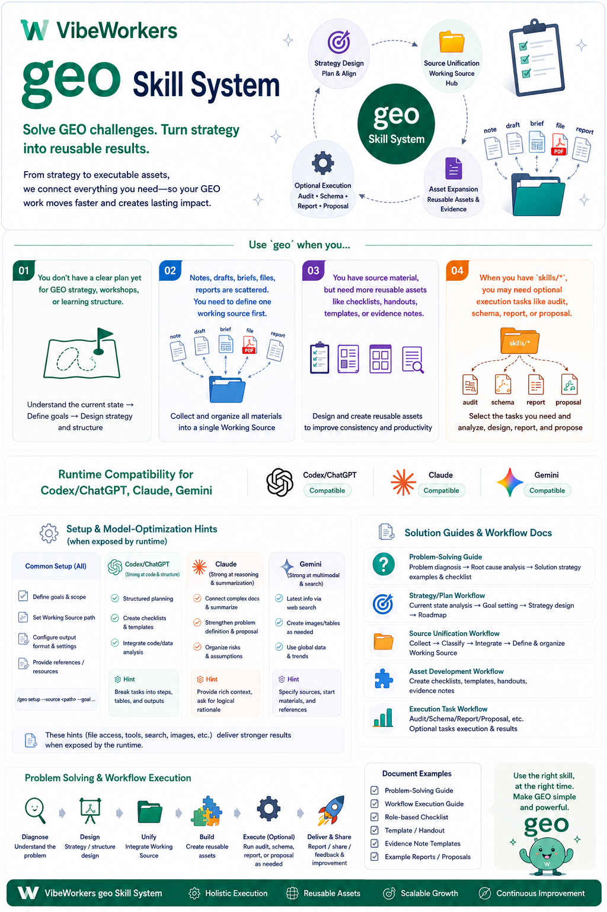
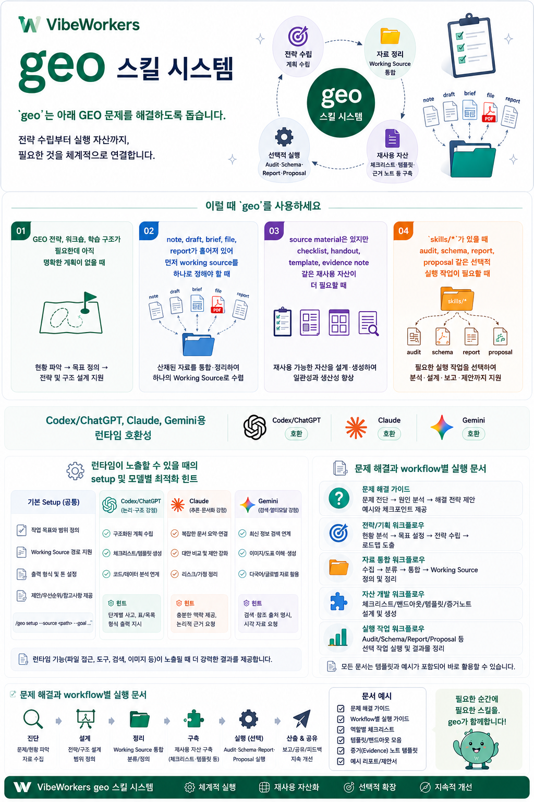

# GEO

This README is bilingual: English first, Korean second.
이 README는 영어 먼저, 한국어 다음 순서의 이중언어 문서입니다.

## English



Portable GEO skill package for turning GEO ideas, notes, and working materials
into structured guidance, reusable assets, and optional execution workflows.

### Quick Summary

`geo` helps solve these GEO work problems:

- you need a GEO strategy, workshop, or learning structure but do not have a clear plan yet
- your notes, drafts, briefs, files, and reports are scattered and you need one working source before editing
- you have source material, but you still need reusable checklists, handouts, templates, or evidence notes
- you need optional execution work such as audits, schema work, reports, or proposals when `skills/*` is available

Additional guidance is included for:

- runtime compatibility across Codex/ChatGPT, Claude, and Gemini
- setup and model-specific optimization hints when a runtime can surface them
- troubleshooting and workflow-specific execution docs
- GitHub-ready intro images in this README plus shareable landing pages with
  Open Graph and schema.org metadata under `docs/`

### Related Cross-Project Use

On 2026-05-08, `references/commerce-readiness.md` was reused in the
`AgenticEra-ContentsMarketing` textbook refresh together with fitCrafting
source material, official Google/OpenAI shopping docs, and Consensus research.
The sibling project's own workspace keeps the detailed output and evidence
pack; this portable package records only the reuse boundary, not machine-local
absolute paths.
The role of `geo` in that refresh was to keep content readiness, merchant
readiness, action readiness, and measurement readiness separated instead of
collapsing them into one generic "AI commerce" claim.

### What This Project Is

`geo` is a portable skill package for GEO strategy, teaching-material design,
evidence work, and optional local execution workflows.
It can start from bundled references, but it is designed to work with the
user's real notes, drafts, files, and source materials when they are provided.

### beta-A Evidence-Based Design

The `beta-A` branch turns `geo` from a descriptive router into a
sequence-dependent GEO execution package.
`beta-A` is not a separate skill name. It is represented by the separate
branch, worktree, or folder boundary, so the representative skill name and
runtime entrypoint remain `geo`.
Its core claim is deliberately limited and evidence-scoped.
Here, external evidence means outside official documentation, standards,
academic literature, or established engineering principles. Repository files
are evidence-based design and implementation proof surfaces: they show where
`beta-A` encodes those principles and how the package validates the contract.
They are not proof of market outcomes.

| Claim | What `beta-A` proves | What it does not prove |
| --- | --- | --- |
| Package capability | The repository contains a portable routing contract, execution references, validator checks, and Korean beta-A guide. | It does not prove that a specific brand gained AI answer visibility. |
| Process capability | All-in requests such as `do everything`, `전체 진행`, or `전부 해줘` can be converted into ordered phases. | It does not remove the need for human approval at destructive, credential, payment, or external-decision steps. |
| Evidence discipline | Readiness, heuristic scores, observed answers, observed citations, referrals, and conversions are separated. | It does not treat readiness as measured market outcome. |
| Portability | Hidden `cogarch` state is not required for normal GEO package use. | It does not ship private generator internals or machine-local runtime state. |

The mechanism is a staged control loop.

| Stage | Mechanism | Evidence-based design / implementation proof surface |
| --- | --- | --- |
| Intake | Lock `goal`, `scope`, `surface`, `success`, and `evidence target` before broad execution. | NIST AI RMF / EBSE principles encoded in `SKILL.md` and `references/gate-conditions.md` |
| Routing | Classify the request into source mode, lane, and optional `skills/geo-*` workflow. | ISO/IEC/IEEE 42010, Parnas, and W3C PROV principles encoded in `SKILL.md` and `references/execution-skill-matrix.md` |
| Dependency ordering | Convert whole-process requests into an ordered dependency graph. | NIST AI RMF lifecycle/risk control encoded in `references/sequence-dependent-autopilot.md` |
| Execution | Run only the next unblocked phase and record owner, status, and evidence. | W3C PROV / EBSE traceability encoded in `references/sequence-dependent-autopilot.md` and `references/cogarch-alignment.md` |
| Claim control | Separate measured facts, interpretation, assumptions, and unknowns. | EBSE, TREC-style evaluation, and causal-inference boundaries encoded in `references/report-template-contract.md` and `references/measurement-loop.md` |
| Completion | Close with `completion_judgment`, `all_must_passed`, `failed_must_queue`, and verification evidence. | EBSE verification and package contract validation encoded in `references/implementation-completion-plan.md` and `scripts/check_geo_skill.py` |

The external basis is a set of public, inspectable principles rather than
private project notes.

| External principle | Source | beta-A design implication |
| --- | --- | --- |
| Architecture descriptions should express system structure, relationships, and viewpoints. | [ISO/IEC/IEEE 42010:2022](https://www.iso.org/standard/74393.html) | Treat identity, context mode, lane, and handoff surfaces as explicit architecture contract elements. |
| Modular decomposition improves understandability and change control when responsibilities are separated by design decisions. | [Parnas 1972](https://doi.org/10.1145/361598.361623) | Keep the representative router separate from advanced `skills/geo-*` execution workflows. |
| Provenance supports quality, reliability, and trustworthiness assessment. | [W3C PROV Overview](https://www.w3.org/TR/prov-overview/) | Track source, phase, actor, evidence, and downstream artifact boundaries. |
| Retrieval evaluation requires topics, documents, and relevance judgments rather than unsupported visibility claims. | [NIST TREC overview](https://trec.nist.gov/about.html) | Treat AI visibility as an observed/captured outcome, not as a readiness claim. |
| Software engineering decisions should integrate best available evidence, practice context, and limitations. | [Evidence-Based Software Engineering](https://doi.org/10.1109/ICSE.2004.1317449) | Require claim labels, verification sets, failed queues, and explicit unknowns. |
| Structured data helps machines understand page content, but platform behavior is governed by platform documentation. | [Google structured data docs](https://developers.google.com/search/docs/guides/search-gallery), [Schema.org](https://schema.org/) | Separate schema validity from rich-result, AI-answer, or commerce outcome claims. |
| Crawler access and indexing controls are technical preconditions with specific semantics. | [Google robots.txt reference](https://developers.google.com/search/reference/robots_txt) | Keep crawler, indexing, `robots.txt`, and `noindex` checks as distinct gates. |
| Content quality evaluation depends on experience, expertise, authoritativeness, trust, and purpose. | [Google Search quality guidance](https://developers.google.com/search/blog/2022/12/google-raters-guidelines-e-e-a-t) | Keep content quality, source credibility, and claim trustworthiness visible in reports. |
| AI risk management should document context, measurement, limitations, and human-AI interaction boundaries. | [NIST AI RMF resources](https://airc.nist.gov/AI_RMF_Knowledge_Base) | Use stop conditions, failed queues, human approval boundaries, and explicit unknowns. |

Academic and professional evidence work should therefore treat `beta-A` as a
methodological package: it formalizes source precedence, phase ordering,
claim labeling, validation, and handoff.
See `docs/beta-a-geo-guide.ko.md` for the Korean full guide with feature
names, effects, mechanisms, external evidence, and evidence-based design /
implementation proof.

### beta Organic System Integration

The beta branch treats `geo` as one organic system, not as two separate
packages that happen to live in one repository.

`beta-A` supplies the root operating contract: clarification, source priority,
sequence-dependent autopilot, evidence closure, and completion judgment.
`beta-B` contributes KR2 judgment for Korean, multilingual, platform, crawler,
AI-readiness, realtime, tracker, batch, and `/geo-code` work.
The existing deep-audit-ecommerce work contributes commerce judgment for
ecommerce and commerce readiness.

The folders stay separate for maintenance, but integration is the priority and
the workflow is unified:

```text
geo core -> capability selection -> shared evidence ledger -> one report contract
```

For ecommerce requests with Korean, multilingual, platform, crawler, realtime,
or tracking concerns, `geo` composes deep-audit-ecommerce and KR2 in one
workflow. For KR2 requests against an ecommerce or commerce property, `geo`
imports the deep-audit-ecommerce rubric before closing readiness.

See `references/organic-capability-system.md` and
`docs/beta/organic-beta-integration.ko.md`.

### Why It Exists

GEO work often gets split across notes, drafts, evidence documents, reusable
assets, and derived outputs.
This project provides one entrypoint so users can start from the right source,
keep source and output separate, and move from GEO thinking to practical
deliverables without depending on a hidden machine-local workspace.

### Installation

Portable baseline installation:

1. Install this package in a supported skill root, or keep this repository
   checkout intact as one package.
2. Keep `SKILL.md`, `README.md`, `agents/`, `references/`, `scripts/`, and
   `LICENSE` together.
3. Run `python3 scripts/check_geo_skill.py` to verify that the package is
   consistent.
4. Start the skill with `geo <request>` or `$geo <request>`.

Advanced workflow installation:

1. Keep the repo-owned `skills/` directory in the same checkout or
   installation.
2. Confirm that subskills such as `skills/geo-audit` and `skills/geo-schema`
   are present.
3. Read the matching `skills/geo-*/SKILL.md` when a workflow needs extra
   tools, network access, or export support.
4. If you are using this repository checkout, that bundle is already included.

### GitHub Sharing and Preview

This README embeds the English and Korean introduction images directly so
repository visitors can see the right overview at the start of each language
section.
This repository also includes Pages-ready landing pages at `docs/index.html`
and `docs/ko/index.html`.
Those pages carry Open Graph and schema.org metadata for shareable project
previews once GitHub Pages is enabled for the `/docs` folder on `main`.
They are supporting delivery surfaces for repository presentation, not part of
the core portable GEO routing contract.
If you want the repository URL `https://github.com/vibeworkers/geo` itself to
show a custom image on social platforms, upload a repository Social preview
image in GitHub Settings. GitHub owns that repository-level preview; README
markdown and committed HTML cannot set it.

### Runtime Compatibility

`geo` uses one shared `geo <request>` or `$geo <request>` contract across
Codex/ChatGPT, Claude, and Gemini.
This repository currently ships native runtime metadata only for Codex /
OpenAI in `agents/openai.yaml`.
Claude and Gemini users should follow the shared GEO contract in this
`README.md` and `SKILL.md`; if a runtime-local surface is added later, it may
run the same advanced-workflow setup guide with runtime-local first-use
wording, installation hints, model-specific setup hints, or response packaging
only.
Automatic runtime-local setup guidance is possible only when that runtime
exposes a native metadata, extension, or skill slot and can surface the active
runtime or model identity.
See `references/runtime-adaptation.md` for current runtime-specific
boundaries.

### Feature Guide

Core router capabilities:

| Capability | What it does | When to use | How to start |
| --- | --- | --- | --- |
| Strategy and learning design | turns raw GEO ideas into lecture, workshop, or study structure | when you have a teaching goal, agenda, or note set but no clear flow yet | `geo design a 90-minute GEO workshop for B2B marketers using these notes.` |
| Source ownership and planning | decides which note, draft, file, or report should own a change | when GEO material is scattered and you need one working surface before editing | `geo decide whether this schema guidance belongs in this brief or this report.` |
| Asset generation | turns source material into checklists, handouts, templates, and evidence notes | when you already have material but need a reusable deliverable | `geo turn these notes into a GEO audit checklist.` |
| Clarification-first intake | asks short pre-questions and freezes goal, scope, surface, success, and evidence target before planning | when the request is broad, ambiguous, or underspecified | `geo improve GEO for this brand.` and answer the follow-up intake questions |

Advanced execution workflows available with `skills/*`:

| Workflow | What it does | When to use | How to start |
| --- | --- | --- | --- |
| `geo-audit` | runs a full GEO + SEO audit across crawler, content, citability, technical, and platform signals | when you need a broad baseline review of a site or property | `geo audit https://example.com for GEO and AI visibility.` |
| `geo-brand-mentions` | reviews external brand mention visibility across the web and AI-visible sources | when you need to understand whether a brand is being surfaced and cited | `geo review brand mentions for Brand X in AI-visible sources.` |
| `geo-citability` | evaluates whether pages are answer-ready and citation-friendly | when inclusion in AI answers matters more than raw traffic alone | `geo assess citability for these product and docs pages.` |
| `geo-compare` | compares GEO gaps against competitors | when prioritization depends on a competitor benchmark | `geo compare example.com with competitor.com for GEO gaps.` |
| `geo-content` | reviews content quality, trust, and E-E-A-T signals | when content exists but depth, authority, or answer quality is weak | `geo review content quality and E-E-A-T for these pages.` |
| `geo-crawlers` | checks `robots.txt`, bot access, `llms.txt`, and crawlability | when crawler access or indexing rules may be blocking visibility | `geo check crawler access, robots.txt, and llms.txt for example.com.` |
| `geo-llmstxt` | audits or drafts `llms.txt` guidance | when a site needs explicit LLM-facing crawling guidance | `geo create an llms.txt recommendation for example.com.` |
| `geo-platform-optimizer` | reviews visibility across Google AI Overviews, Perplexity, ChatGPT, Copilot, and Grok | when you want platform-specific GEO exposure guidance | `geo review how this brand shows up across ChatGPT, Perplexity, and Google AI Overviews.` |
| `geo-proposal` | turns findings into a scoped proposal or remediation plan | when audit work must become an actionable roadmap | `geo draft a 6-week proposal from these GEO findings.` |
| `geo-prospect` | runs a lightweight discovery scan for sales or consulting | when you need a fast first-pass prospect review before deeper work | `geo run a prospect scan for example.com.` |
| `geo-report` | combines multiple findings into one report | when separate GEO findings need executive synthesis | `geo combine these crawler, schema, and technical findings into one report.` |
| `geo-report-pdf` | packages markdown for PDF delivery | when client delivery needs print-oriented formatting | `geo package this GEO report for PDF delivery.` |
| `geo-schema` | generates or validates JSON-LD schema | when a page needs schema markup or schema correction | `geo create JSON-LD for this product page.` |
| `geo-technical` | diagnoses technical SEO and implementation risks | when rendering, performance, architecture, or indexing issues block GEO | `geo run a technical GEO review for example.com.` |

### How To Use

Stored prompts are written in English.

At the first interaction of a new GEO session, the LLM asks:

```text
Choose conversation language: Korean or English.
```

Use either of these commands to start:

- `geo <request>`
- `$geo <request>`

During the session, switch only the conversation language with:

```text
geo language Korean
geo language English
$geo language Korean
$geo language English
```

Choose the closest capability or workflow from the feature guide, then phrase
the request directly in one sentence or one short packet with your materials.

When you provide your own notes, files, pasted text, or explicit file paths,
those materials become the working source of truth.
If goal, scope, working surface, success condition, or evidence target are
still unclear, GEO asks a short pre-question set first and locks those
completion conditions before planning.
`geo` uses `VibeWorkers` as its output brand.
The official website for that brand is <https://vibeworkers.net>.
If your project, client, or confirmed source carries its own brand, that
source brand should own the output surface instead. If no stronger source
brand is supplied, outputs default to `VibeWorkers`.

### Optional Advanced Workflows

When the local execution bundle `skills/*` is present, GEO can route advanced
work such as audit, crawlers, `llms.txt`, schema, compare, report, proposal,
prospect, and technical review workflows.
Each `skills/geo-*` subskill owns its own workflow contract.
The representative `geo` router selects a subskill, but you should be able to
read and use that subskill directly from the files included in this package.

### Enable Advanced Workflows

Advanced workflows are available only when the local `skills/*` bundle is part
of your GEO installation or checkout.
If you are using this repository checkout, that bundle is already included.
Think of advanced-workflow setup as the getting-started guide for this
environment.
When an advanced workflow is requested for the first time in a local
environment, GEO may walk through this guide before it starts the workflow.
If the active runtime or model changes, GEO may walk through the same guide
again because setup hints, permissions, or export steps can differ.
Some runtimes can show this guide automatically. Otherwise, follow it manually
here, in
`references/execution-skill-matrix.md`, and in the matching
`skills/geo-*/SKILL.md`.

To make advanced workflows available:

- keep the `skills/` directory together with this package
- verify that subskills such as `skills/geo-audit` and `skills/geo-schema` are
  present
- start through `geo <request>` or `$geo <request>` and ask for a concrete
  audit, crawler, schema, compare, report, proposal, prospect, or technical
  review task
- check the matching subskill when a workflow needs extra tools, network
  access, or export tooling
- treat the matching subskill as the workflow owner for setup, permissions,
  and output details; the top-level `geo` router only routes you there

### Advanced Workflow Troubleshooting

If advanced workflows are not available or do not start as expected:

- verify that `skills/` is present in the same checkout or installation as this
  package
- if you copied only `README.md` and `SKILL.md`, reinstall from a GEO checkout
  or package that also includes `skills/*`
- if you are unsure which workflow to use, start with a plain request through
  `geo <request>` or `$geo <request>` and let the router choose the matching
  subskill
- if GEO asks clarification questions first, answer them before expecting an
  audit, schema, report, or other execution workflow to start
- if you switched to a different runtime or model, rerun the setup guide before
  expecting the same workflow to continue with unchanged hints or permissions
- if the matching subskill needs tools, network access, credentials, or export
  steps, open that subskill's `SKILL.md` and follow its local contract
- if your runtime does not provide automatic setup-guide onboarding, use this
  `README.md`, `references/execution-skill-matrix.md`, and the matching
  `skills/geo-*/SKILL.md` directly; you should not need any separate hidden
  global setup or a command from an earlier session just to start

### Project Docs

- `README.md`: project introduction, installation, and feature guide
- `SKILL.md`: full GEO routing contract
- `references/versioning-protocol.md`: release rules and the three-part `X.Y.Z` version structure
- `references/runtime-adaptation.md`: runtime compatibility and per-runtime boundaries
- `references/execution-skill-matrix.md`: advanced execution workflow list
- `references/user-level-workflow-guide.md`: manager/operator/builder output guidance for advanced workflows
- `references/measurement-loop.md`: evidence ladder for measured GEO outcome claims
- `references/commerce-readiness.md`: commerce/action readiness boundary
- `references/platform-truth-registry.md`: verified platform/crawler/source claim registry
- `references/measurement-capture-template.md`: repeatable answer, citation, referral, and conversion capture template
- `references/commerce-audit-worksheet.md`: product, schema, merchant, catalog, checkout/action, and measurement worksheet
- `references/private-surface-routing.md`: public, private, logged-in, connector, and user-provided context boundary
- `references/regional-situational-routing.md`: regional, vertical, and brand-maturity routing boundary
- `references/policy-risk-gate.md`: robots, terms, privacy, regulated claims, brand claims, and commerce eligibility gate
- `references/report-template-contract.md`: required report metadata and claim-label contract
- `references/implementation-completion-plan.md`: P2-P13 requirement, sequence, verification, and completion plan
- `references/cogarch-alignment.md`: optional governance alignment for evidence closure, owner split, actor-first handoff, and portable knowledge packets
- `references/sequence-dependent-autopilot.md`: end-to-end process autopilot for all-in requests such as `전부 해줘`, `전체 진행`, and `do everything`
- `references/organic-capability-system.md`: organic composition contract for deep-audit-ecommerce and KR2 inside one `geo` system
- `docs/beta-a-geo-guide.ko.md`: Korean beta-A guide covering feature names, effects, mechanisms, evidence, and the end-to-end GEO process
- `docs/beta/organic-beta-integration.ko.md`: Korean beta integration guide for the single-system design
- `packages/geo-seo-skills-kr2/`: KR2 capability package with evidence boundaries, source index, function matrix, and local Code extensions
- `reports/benchmarks/2026-05-08-haegyung-main-vs-beta/`: versioned Korean benchmark report and source metrics for `haegyung.com`
- `skills/geo-*/SKILL.md`: workflow-specific setup, permissions, and outputs

### System Notes

`geo` is packaged as one portable skill with one representative router.
`SKILL.md` owns the routing contract, `skills/geo-*` own advanced execution
workflows, and `references/runtime-adaptation.md` records runtime-specific
boundaries.
This package was implemented with a private `generateSkill` workflow derived
from the public Skill Creator skill and a Cognitive Architecture based skill
design.

### Package Provenance

This package was created with a private `generateSkill` workflow derived from
the public Skill Creator skill.
The private creator workflow is not included in this repository; this
repository ships the resulting GEO package and its user-facing docs.

### License

This repository is licensed under `CC BY-NC-ND 4.0`
(`Creative Commons Attribution-NonCommercial-NoDerivatives 4.0 International`).

- Authors: 김범수, 유수호, 고경만.
- See `LICENSE` for repository terms.
- Canonical deed: <https://creativecommons.org/licenses/by-nc-nd/4.0/>
- Canonical legal code: <https://creativecommons.org/licenses/by-nc-nd/4.0/legalcode>

## 한국어



GEO 아이디어, 노트, 작업 자료를 구조화된 가이드, 재사용 자산, 선택적 실행
workflow로 연결하는 portable GEO skill 패키지입니다.

### 한눈 요약

`geo`는 아래 GEO 문제를 해결하도록 돕습니다.

- GEO 전략, 워크숍, 학습 구조가 필요한데 아직 명확한 계획이 없을 때
- note, draft, brief, file, report가 흩어져 있어 먼저 working source를 하나로 정해야 할 때
- source material은 있지만 checklist, handout, template, evidence note 같은 재사용 자산이 더 필요할 때
- `skills/*`가 있을 때 audit, schema, report, proposal 같은 선택적 실행 작업이 필요할 때

추가로 아래 안내를 함께 제공합니다.

- Codex/ChatGPT, Claude, Gemini용 런타임 호환성
- 런타임이 노출할 수 있을 때의 setup 및 모델별 최적화 힌트
- 문제 해결과 workflow별 실행 문서
- 이 README의 GitHub용 소개 이미지와 `docs/` 아래 Open Graph /
  schema.org 공유 페이지

### 교차 프로젝트 사용 기록

2026-05-08 기준 `references/commerce-readiness.md`는 fitCrafting source,
Google/OpenAI 공식 shopping 문서, Consensus research와 함께
`AgenticEra-ContentsMarketing` 교재 refresh에 재사용됐다.
상세 산출물과 evidence pack은 해당 sibling project workspace가 소유하며,
이 portable package에는 machine-local absolute path를 기록하지 않고 재사용
경계만 남긴다.
이때 `geo`의 역할은 content readiness, merchant readiness, action readiness,
measurement readiness를 한 덩어리 "AI commerce" 주장으로 뭉개지지 않게
분리하는 기준을 제공하는 것이었다.

### 이 프로젝트는 무엇인가

`geo`는 GEO 전략, 교육 자료 설계, 외부 근거 기반 판단, 그리고 선택적인
로컬 실행 workflow를 위한 portable skill 패키지입니다.
bundled reference만으로 시작할 수도 있지만, 사용자의 실제 note, draft, file,
source material이 주어지면 그 자료를 기준으로 동작하도록 설계되어 있습니다.

### beta-A 구조적 입증 문서

`beta-A`의 핵심 주장은 "GEO를 잘한다"가 아니라, 더 좁고 검증 가능한
명제입니다.

`beta-A`는 GEO 작업을 source 확인, routing, 순서의존적 실행, 검증,
claim 분리, handoff, 완료 판단으로 나누는 portable execution package입니다.
`beta-A`는 별도 스킬명이 아닙니다. 별도 브랜치, worktree, 폴더가 beta-A
변형을 구분하므로 대표 스킬명과 runtime 진입점은 계속 `geo`입니다.

이 README에서 `근거`는 현재 저장소의 파일이 아니라, 우리 외부의 공식
문서, 표준, 학술 문헌, 또는 공학적으로 타당한 원리를 뜻합니다.
현재 저장소의 파일, 계약, validator, reference 문서는 외부 근거 자체가
아니라 `근거 기반 설계/구현 입증 증거`입니다. 즉 아래 표의 마지막 열은
"외부 근거와 공학 원리가 현재 beta-A 기능 구조에 실제로 반영돼 있다"는
점을 보여주는 구현 surface와 검증 surface입니다. 특정 외부 플랫폼에서
AI 답변 노출이나 conversion이 실제로 증가했다는 실측 근거는 아닙니다.

#### 1. 핵심 명제와 입증 경계

| 구분 | beta-A가 입증하는 것 | beta-A가 입증하지 않는 것 | 판단 기준 |
| --- | --- | --- | --- |
| 방법론 | GEO 작업을 반복 가능한 단계와 gate로 분해할 수 있음 | 특정 시장 성과가 자동 발생함 | 단계, gate, validator 존재 |
| 실행성 | `전부 해줘`, `전체 진행` 같은 요청을 ordered process로 바꿀 수 있음 | 사용자 승인 없이 위험 작업까지 자동 수행함 | stop condition과 failed queue |
| 근거/측정 분리 | readiness, heuristic, observed outcome을 분리할 수 있음 | readiness를 실측 성과로 대체함 | evidence label과 claim ledger |
| 이식성 | 숨은 local state 없이 패키지 파일만으로 읽히고 검증될 수 있음 | private generator나 cogarch runtime을 포함함 | portable contract와 validator |

#### 2. 기능 이름, 효과, 메커니즘, 근거 기반 설계/구현 입증 증거

마지막 열은 단순 파일 목록이 아닙니다. 각 기능이 어떤 외부 근거 또는
공학 원리에 의해 정당화되고, 그 원리가 beta-A의 어느 구현 surface와
검증 surface에 반영돼 있는지를 요약합니다. 상세 매핑은
`docs/beta-a-geo-guide.ko.md`의 `전체 기능 및 근거 기반 구현 매칭 표`를
기준으로 합니다.

| 기능 이름 | 효과 | 메커니즘 | 근거 기반 설계/구현 입증 증거 |
| --- | --- | --- | --- |
| 대표 GEO router | 사용자가 하나의 entrypoint로 시작할 수 있음 | `geo <request>` / `$geo <request>` 요청을 context mode와 lane으로 분류 | ISO/IEC/IEEE 42010, Parnas, W3C PROV, NIST AI RMF 원리가 `SKILL.md` `Identity`, `Context Modes`, `Request Classification`에 반영되고 `scripts/check_geo_skill.py`가 필수 계약 섹션을 검증 |
| Clarification-first intake | 모호한 목표로 바로 실행하는 위험 감소 | `goal`, `scope`, `surface`, `success`, `evidence target`을 먼저 고정 | NIST AI RMF와 EBSE의 context/evidence decision 원리가 `SKILL.md`와 `references/gate-conditions.md` Gate 2에 반영 |
| Source-order 보호 | 원본보다 downstream 산출물을 먼저 고치는 오류 방지 | user material, local source, bundled reference의 우선순위를 구분 | W3C PROV와 EBSE의 provenance/source precedence 원리가 `SKILL.md`와 `references/concept-map.md`에 반영 |
| Execution skill matrix | 감사, schema, report, proposal을 전용 workflow로 연결 | 요청 의도와 `skills/*` 존재를 확인한 뒤 matching subskill 선택 | Parnas의 modular decomposition 원리가 `references/execution-skill-matrix.md`의 router/subskill 책임 분리에 반영 |
| Sequence-dependent autopilot | 사용자가 절차를 몰라도 전체 수행 가능 | all-in trigger를 dependency graph, phase execution, verification으로 변환 | NIST AI RMF와 EBSE의 bounded process/evidence closure 원리가 `references/sequence-dependent-autopilot.md`에 반영되고 validator가 autopilot phrase를 검증 |
| Cogarch alignment | 넓은 요청을 실행 가능한 판단 루프로 닫음 | Goal, Rubric, Iteration, Score, Next Action 구조를 GEO에 맞게 적용 | EBSE decision cycle과 ISO stakeholder/viewpoint 원리가 `references/cogarch-alignment.md`의 evidence closure, owner split, actor-first handoff에 반영 |
| Claim boundary ledger | 과장된 GEO claim 방지 | 사실, 해석, 가정, 불확실성을 별도 ledger로 기록 | EBSE와 experimental design의 claim/interpretation separation 원리가 `references/report-template-contract.md`에 반영 |
| Measurement loop | 실측 성과와 준비 상태를 분리 | observed answer, citation, referral, conversion capture를 별도 상태로 둠 | NIST TREC의 retrieval evaluation 구조와 causal inference 경계가 `references/measurement-loop.md`와 `SKILL.md` Gate 8에 반영 |
| Commerce/action readiness | schema validity를 commerce 성과로 오인하지 않음 | product, schema, merchant, catalog, checkout, measurement readiness 분리 | JSON-LD, Schema.org, Google structured data/merchant 문서의 eligibility 경계가 `references/commerce-readiness.md`와 `references/commerce-audit-worksheet.md`에 반영 |
| Policy risk gate | 정책/법적 위험을 workflow 안에서 노출 | robots, terms, privacy, regulated claim, brand claim, commerce eligibility 점검 | RFC 9309, platform crawler 문서, NIST AI RMF risk-control 원리가 `references/policy-risk-gate.md`와 `SKILL.md` Gate 12에 반영 |
| Completion boundary | 완료를 감으로 선언하지 않음 | `completion_judgment`, `all_must_passed`, `failed_must_queue`, `verification_set` 요구 | EBSE verification/limitation 원리와 NIST AI RMF evaluation boundary가 `references/implementation-completion-plan.md`와 `SKILL.md` Gate 13에 반영 |
| Validator hardening | 문서 계약 누락을 자동으로 감지 | 필수 reference, gate, phrase, portability 조건 검사 | architecture contract와 reproducibility 원리가 `scripts/check_geo_skill.py`에 반영되고 `python3 scripts/check_geo_skill.py`로 검증 |

#### 3. 순서의존적 실행 메커니즘

| 순서 | 단계 | 입력 | 처리 | 출력 |
| --- | --- | --- | --- | --- |
| 1 | Intake | 사용자 요청 | 목표와 evidence target 고정 | clarification packet |
| 2 | Source selection | 파일, URL, pasted text, bundled reference | source of truth와 downstream output 분리 | source mode |
| 3 | Lane routing | 요청 의도 | framework, working source, evidence, asset, execution, deliverable lane 선택 | owning lane |
| 4 | Autopilot trigger | `전체 진행`, `전부 해줘`, `do everything` | 전체 수행 요청 여부 판정 | autopilot on/off |
| 5 | Dependency graph | 선택된 lane과 workflow | 먼저 해야 할 phase와 blocked phase 분리 | ordered phase list |
| 6 | Phase execution | 다음 unblocked phase | 최소 안전 단위 실행 | artifact 또는 evidence |
| 7 | Verification | validator, report contract, capture template | 통과/실패와 구현 검증 기록 | verification set |
| 8 | Ledger | 측정값과 판단 | 사실, 해석, 가정, 불확실성 분리 | claim boundary ledger |
| 9 | Handoff | 수신자 profile | manager/operator/builder용 결과 포장 | actor-first handoff |
| 10 | Closeout | phase 결과 전체 | 완료 또는 blocker 선언 | completion judgment |

#### 4. 증거와 판단 수준

| 수준 | 의미 | beta-A에서의 사용 |
| --- | --- | --- |
| External evidence | 공식 문서, 표준, 학술 문헌, 공학 원리 | 기능의 필요성과 판단 경계 정당화 |
| Evidence-based design / implementation proof | 실제 저장소 파일, validator, reference 계약 | 외부 근거와 공학 원리가 beta-A 기능 구조에 반영됐는지 판단 |
| Methodological principle | 단계화, gate, source precedence, claim labeling | 학문적/전문적 설명 구조 |
| Observational evidence | 특정 prompt, 날짜, source URL, capture artifact | AI answer/citation/referral 같은 실측 claim에만 사용 |
| Interpretive judgment | 측정 결과가 의미하는 전략적 판단 | 보고서의 interpretation section에만 배치 |
| Assumption | 아직 검증되지 않았지만 작업상 임시 채택한 조건 | assumptions ledger에 명시 |
| Unknown | 현재 외부 근거, 근거 기반 설계/구현 입증 증거, 관측 증거로 알 수 없는 내용 | unknowns 또는 failed queue에 명시 |

#### 5. 외부 원리 근거

`beta-A`는 GEO를 단일 점수나 단일 최적화 기법으로 보지 않습니다.
대신 정보 검색, 출처 신뢰성, 구조화 데이터, 문서 품질, platform policy,
측정 가능성, 실행 가능성을 분리된 변수로 다룹니다.

아래 표의 외부 근거는 beta-A가 내부적으로 정리한 주장보다 상위의 판단
기반입니다. 즉 저장소 파일은 이 원리들이 beta-A에 구현되었는지를 보여주는
증거이고, 원리 자체의 타당성은 외부 표준, 공식 문서, 학술/공학 관행에
기반합니다.

| 외부 원리 | 외부 근거 | beta-A 적용 | 논리적 효과 |
| --- | --- | --- | --- |
| Provenance와 traceability | [W3C PROV Overview](https://www.w3.org/TR/prov-overview/)는 data나 thing을 만든 entity, activity, people 정보를 품질, 신뢰성, trustworthiness 평가에 쓸 수 있는 provenance로 설명한다. | phase별 source, actor, evidence, downstream artifact를 ledger에 기록한다. | 어떤 산출물이 어떤 근거와 활동에서 나왔는지 추적 가능해진다. |
| 정보검색 평가는 관측과 relevance judgment가 필요함 | [NIST TREC](https://trec.nist.gov/about.html)은 retrieval system을 test collection, topic, relevance judgment, evaluation software로 평가하는 연구 기반을 제공한다. | AI answer visibility, citation, referral, conversion은 readiness가 아니라 capture artifact가 있을 때만 observed claim으로 다룬다. | "노출될 가능성"과 "실제로 관측됨"을 구분한다. |
| 구조화 데이터는 이해 가능성을 높이지만 결과를 보장하지 않음 | [Google Search structured data documentation](https://developers.google.com/search/docs/guides/search-gallery)은 structured data가 페이지 내용을 이해하고 rich result에 활용될 수 있음을 설명하고, [Schema.org](https://schema.org/)는 웹 구조화 데이터 vocabulary를 제공한다. | `geo-schema`는 schema validity와 platform outcome을 분리한다. | schema가 맞다는 사실을 AI 답변 노출이나 commerce 성과로 과장하지 않는다. |
| crawler와 indexing control은 구분되어야 함 | [Google robots.txt reference](https://developers.google.com/search/reference/robots_txt)는 Google crawler가 `robots.txt`를 crawl 가능 범위 판단에 사용한다고 설명한다. | crawler access, indexing, `robots.txt`, `noindex`, `llms.txt`를 별도 gate로 둔다. | 기술적 접근 가능성과 검색/AI 노출 가능성을 혼동하지 않는다. |
| 콘텐츠 품질은 경험, 전문성, 권위, 신뢰와 연결됨 | [Google Search Central의 E-E-A-T 안내](https://developers.google.com/search/blog/2022/12/google-raters-guidelines-e-e-a-t)는 creators가 Search 성공을 self-assess할 때 품질 가이드가 유용할 수 있음을 설명한다. | content quality, source credibility, author/surface trust를 report claim과 분리해 기록한다. | 단순 keyword 최적화가 아니라 신뢰 가능한 답변 source 요건을 점검한다. |
| AI/automation은 context, risk, human boundary를 문서화해야 함 | [NIST AI RMF resources](https://airc.nist.gov/AI_RMF_Knowledge_Base)는 AI risk management operationalization과 documentation practice를 다룬다. | destructive, credential, payment, external decision, unclear validation failure에서 stop condition을 둔다. | 자동 수행이 승인/책임/법적 판단을 넘지 않도록 경계를 만든다. |

#### 6. 학문적/논리적 정당화

| 원리 | beta-A 적용 | 왜 필요한가 |
| --- | --- | --- |
| Source precedence | 원본 source와 downstream output 분리 | derived artifact를 근거로 다시 원본을 왜곡하지 않기 위해 |
| Traceability | phase별 evidence와 ledger 기록 | provenance 원리에 맞춰 판단 경로를 재검토하기 위해 |
| Falsifiability | readiness와 observed outcome 분리 | 정보검색 평가처럼 관측과 판단을 분리하기 위해 |
| Reproducibility | validator와 template 기반 검증 | 같은 package를 다른 runtime이나 checkout에서도 확인하기 위해 |
| Bounded automation | stop condition과 failed queue | 자동화가 승인, 결제, 자격 증명, 법적 판단을 넘지 않게 하기 위해 |
| Actor relevance | manager/operator/builder handoff | 같은 외부 근거와 근거 기반 설계/구현 입증 증거를 의사결정, 운영, 구현에 맞게 전달하기 위해 |

전체 한국어 설명서는 `docs/beta-a-geo-guide.ko.md`에 있으며, 이 README의
표는 그 문서를 저장소 첫 화면에서 바로 이해할 수 있도록 압축한 입증 map입니다.

### beta 유기적 시스템 통합

`beta` 브랜치는 `beta-A`와 `beta-B`를 따로 붙인 묶음이 아니라, 하나의
`geo` 실행 시스템입니다.

`beta-A`는 clarification, source priority, sequence-dependent autopilot,
evidence closure, completion judgment를 제공하는 루트 운영 계약입니다.
`beta-B`는 한국어, 다국어, platform, crawler, AI-readiness, realtime,
tracker, batch, `/geo-code` 판단 능력을 `geo`에 제공합니다.
기존 deep-audit-ecommerce 작업은 ecommerce와 commerce readiness 판단 능력을
`geo`에 제공합니다.

폴더는 유지보수 경계를 위해 분리하지만, 개별 보고서 보존보다 통합이
우선이며 실행 workflow는 하나로 닫습니다.

```text
geo core -> capability selection -> shared evidence ledger -> one report contract
```

ecommerce 요청이 한국어, 다국어, platform, crawler, realtime, tracking 문제를
포함하면 `geo`는 deep-audit-ecommerce와 KR2를 하나의 workflow로 결합합니다.
KR2 요청이 ecommerce나 commerce property를 대상으로 하면, readiness를 닫기
전에 deep-audit-ecommerce rubric을 함께 사용합니다.

자세한 계약은 `references/organic-capability-system.md`와
`docs/beta/organic-beta-integration.ko.md`를 기준으로 합니다.

### 왜 존재하는가

GEO 작업은 note, draft, evidence document, 재사용 asset, derived output으로
쉽게 흩어집니다.
이 프로젝트는 사용자가 올바른 source에서 시작하고, source와 output을
분리하며, 숨겨진 machine-local workspace에 의존하지 않고도 GEO 사고를 실제
deliverable로 이어갈 수 있게 하나의 entrypoint를 제공합니다.

### 설치

Portable baseline 설치:

1. 이 패키지를 지원되는 skill root에 설치하거나, 이 저장소 checkout 전체를
   하나의 패키지로 유지합니다.
2. `SKILL.md`, `README.md`, `agents/`, `references/`, `scripts/`,
   `LICENSE`를 함께 유지합니다.
3. `python3 scripts/check_geo_skill.py`를 실행해 패키지 정합성을
   확인합니다.
4. `geo <request>` 또는 `$geo <request>`로 시작합니다.

Advanced workflow 설치:

1. repo 소유 `skills/` 디렉터리를 같은 checkout 또는 installation 안에
   함께 둡니다.
2. `skills/geo-audit`, `skills/geo-schema` 같은 서브스킬이 실제로 있는지
   확인합니다.
3. workflow에 추가 도구, 네트워크 접근, export 지원이 필요하면 해당
   `skills/geo-*/SKILL.md`를 읽습니다.
4. 이 저장소 checkout을 그대로 사용한다면 그 번들은 이미 포함되어
   있습니다.

### GitHub 공유와 미리보기

이 README는 영문/국문 섹션 시작부에 소개 이미지를 직접 넣어 저장소 방문자가
언어별 개요를 바로 볼 수 있게 합니다.
이 저장소에는 `docs/index.html`, `docs/ko/index.html` 형태의 Pages-ready
landing page도 함께 포함되어 있습니다.
이 페이지들은 `main` 브랜치의 `/docs` 폴더로 GitHub Pages를 활성화하면
Open Graph와 schema.org 메타데이터를 가진 공유용 소개 페이지로 동작합니다.
이 공유 페이지들은 저장소 소개를 위한 보조 delivery surface이며, portable
GEO 라우팅 핵심 계약 자체는 아닙니다.
반대로 `https://github.com/vibeworkers/geo` 저장소 URL 자체가 소셜 플랫폼에서
특정 이미지를 보이게 하려면 GitHub Settings의 repository Social preview
이미지를 별도로 업로드해야 합니다. 그 저장소 수준 미리보기는 GitHub가
소유하므로 README markdown이나 커밋된 HTML만으로는 설정할 수 없습니다.

### 런타임 호환성

`geo`는 Codex/ChatGPT, Claude, Gemini에서 공통 `geo <request>` 또는
`$geo <request>` 계약으로 사용합니다.
현재 이 저장소는 Codex / OpenAI용 native runtime metadata만
`agents/openai.yaml`로 포함합니다.
Claude와 Gemini 사용자는 지금은 이 `README.md`와 `SKILL.md`의 공통 GEO
계약을 따라 사용하고, 나중에 runtime-local surface가 추가되더라도 같은 고급
workflow setup guide를 런타임별 첫 실행 문구, 설치 힌트, 모델별 setup 힌트,
응답 포장 수준에서만 다르게 얹을 수 있습니다.
자동 런타임별 setup guide는 해당 런타임이 native metadata, extension,
skill slot을 제공하고 현재 활성 런타임 또는 모델 정체성을 드러낼 수 있을 때만
가능합니다.
현재 런타임별 경계는 `references/runtime-adaptation.md`를 참고하세요.

### 기능 가이드

기본 라우터 기능:

| 기능 | 무엇을 하는가 | 언제 쓰는가 | 어떻게 시작하는가 |
| --- | --- | --- | --- |
| 전략 및 학습 설계 | GEO 아이디어를 강의, 워크숍, 학습 구조로 정리합니다 | 교육 목표, 아젠다, 노트는 있지만 흐름이 아직 없을 때 | `geo design a 90-minute GEO workshop for B2B marketers using these notes.` |
| source 소유권 판단과 계획 | 어떤 note, draft, file, report가 수정의 정본이 될지 정합니다 | GEO 자료가 흩어져 있어 먼저 작업 surface를 고정해야 할 때 | `geo decide whether this schema guidance belongs in this brief or this report.` |
| 재사용 자산 생성 | source material을 checklist, handout, template, evidence note로 바꿉니다 | 원자료는 있지만 재사용 가능한 deliverable이 아직 없을 때 | `geo turn these notes into a GEO audit checklist.` |
| 사전 질문 intake | 계획 전에 goal, scope, surface, success, evidence target을 짧게 잠급니다 | 요청이 넓거나 모호하거나 누락이 있을 때 | `geo improve GEO for this brand.`라고 시작한 뒤 후속 intake 질문에 답합니다 |

`skills/*`가 있을 때 사용할 수 있는 고급 실행 workflow:

| Workflow | 무엇을 하는가 | 언제 쓰는가 | 어떻게 시작하는가 |
| --- | --- | --- | --- |
| `geo-audit` | crawler, content, citability, technical, platform 신호를 함께 보는 전체 GEO + SEO 감사 | 사이트나 자산의 전체 상태를 한 번에 점검해야 할 때 | `geo audit https://example.com for GEO and AI visibility.` |
| `geo-brand-mentions` | 웹과 AI 노출 source에서 브랜드 언급 가시성을 점검합니다 | 브랜드가 실제로 얼마나 노출되고 인용되는지 알고 싶을 때 | `geo review brand mentions for Brand X in AI-visible sources.` |
| `geo-citability` | 페이지가 답변용 source로 인용되기 쉬운지 평가합니다 | 단순 트래픽보다 AI 답변 내 포함 가능성이 중요할 때 | `geo assess citability for these product and docs pages.` |
| `geo-compare` | 경쟁사 대비 GEO 격차를 비교합니다 | 우선순위를 경쟁사 기준으로 잡아야 할 때 | `geo compare example.com with competitor.com for GEO gaps.` |
| `geo-content` | 콘텐츠 품질, 신뢰, E-E-A-T 신호를 검토합니다 | 콘텐츠는 있지만 깊이, 권위, 답변 품질이 약할 때 | `geo review content quality and E-E-A-T for these pages.` |
| `geo-crawlers` | `robots.txt`, bot access, `llms.txt`, crawlability를 점검합니다 | 크롤러 접근이나 인덱싱 규칙이 노출을 막고 있을 수 있을 때 | `geo check crawler access, robots.txt, and llms.txt for example.com.` |
| `geo-llmstxt` | `llms.txt`를 감사하거나 초안을 만듭니다 | 사이트에 LLM 대상 가이드가 필요할 때 | `geo create an llms.txt recommendation for example.com.` |
| `geo-platform-optimizer` | Google AI Overviews, Perplexity, ChatGPT, Copilot, Grok 기준으로 노출을 검토합니다 | 특정 AI 답변 플랫폼 기준 최적화가 필요할 때 | `geo review how this brand shows up across ChatGPT, Perplexity, and Google AI Overviews.` |
| `geo-proposal` | GEO findings를 제안서나 개선 계획으로 바꿉니다 | 감사 결과를 실행 가능한 로드맵으로 넘겨야 할 때 | `geo draft a 6-week proposal from these GEO findings.` |
| `geo-prospect` | 영업/컨설팅용 가벼운 discovery scan을 수행합니다 | 본격 작업 전에 잠재 고객을 빠르게 훑어야 할 때 | `geo run a prospect scan for example.com.` |
| `geo-report` | 여러 GEO findings를 하나의 보고서로 통합합니다 | 개별 결과를 임원용 또는 종합 보고서로 묶어야 할 때 | `geo combine these crawler, schema, and technical findings into one report.` |
| `geo-report-pdf` | PDF 전달용 markdown 패키지를 만듭니다 | 클라이언트 전달이 인쇄형 포맷을 필요로 할 때 | `geo package this GEO report for PDF delivery.` |
| `geo-schema` | JSON-LD schema를 생성하거나 검증합니다 | 페이지에 schema markup이 필요하거나 오류를 고쳐야 할 때 | `geo create JSON-LD for this product page.` |
| `geo-technical` | 기술 SEO와 구현 리스크를 진단합니다 | 렌더링, 성능, 구조, 인덱싱 문제가 GEO를 막고 있을 때 | `geo run a technical GEO review for example.com.` |

### 사용하는 방법

저장된 prompt는 영어로 작성합니다.

새 GEO session의 첫 상호작용에서 LLM은 아래 질문을 합니다.

```text
Choose conversation language: Korean or English.
```

시작 명령은 아래 둘 중 하나를 사용합니다.

- `geo <request>`
- `$geo <request>`

세션 중에는 아래 명령으로 대화 언어만 변경합니다.

```text
geo language Korean
geo language English
$geo language Korean
$geo language English
```

기능 가이드에서 가장 가까운 기능이나 workflow를 고른 뒤, 가지고 있는
자료와 함께 한 문장 또는 짧은 요청 묶음으로 바로 시작합니다.

사용자가 자신의 note, file, pasted text, explicit file path를 제공하면 그
자료가 working source of truth가 됩니다.
goal, scope, working surface, success condition, evidence target이 아직
불명확하면 GEO는 먼저 짧은 사전 질문으로 완료 조건을 잠근 뒤 계획을
세웁니다.
`geo`의 output brand는 `VibeWorkers`입니다.
해당 brand의 공식 웹 주소는 <https://vibeworkers.net>입니다.
프로젝트, client, confirmed source에 자체 brand가 있으면 그 source brand가
출력 surface를 소유해야 합니다. 더 강한 source brand가 없으면 출력 기본
brand는 `VibeWorkers`입니다.

### 선택적 고급 Workflow

로컬 실행 번들 `skills/*`가 있으면 audit, crawlers, `llms.txt`, schema,
compare, report, proposal, prospect, technical review 같은 고급 workflow로
라우팅할 수 있습니다.
각 `skills/geo-*` 서브스킬은 자기 workflow 계약을 직접 소유합니다.
대표 `geo` 라우터는 해당 서브스킬로 연결하지만, 서브스킬 자체는
이 패키지에 포함된 문서와 파일만으로도 읽고 따라갈 수 있어야 합니다.

### 고급 Workflow 준비

고급 workflow는 로컬 `skills/*` 번들이 현재 GEO 설치본 또는 checkout에 함께
있을 때만 사용할 수 있습니다.
이 저장소 checkout을 그대로 사용한다면 그 번들은 이미 포함되어 있습니다.
고급 workflow setup은 이 환경에서 처음 시작할 때 보는 사용 가이드라고
이해하면 됩니다.
로컬 환경에서 고급 workflow를 처음 요청하면 workflow가 시작되기 전에 이
guide를 먼저 따라갈 수 있습니다.
현재 활성 런타임이나 모델이 바뀌면 setup 힌트, 권한, export 단계가 달라질 수
있으므로 같은 guide를 다시 볼 수 있습니다.
자동으로 보여주는 런타임도 있고, 그렇지 않으면 여기와
`references/execution-skill-matrix.md`, 해당 `skills/geo-*/SKILL.md`를
따라 수동으로 같은 setup을 수행합니다.

고급 workflow를 사용할 수 있게 하려면:

- `skills/` 디렉터리를 이 패키지와 함께 유지합니다
- `skills/geo-audit`, `skills/geo-schema` 같은 서브스킬이 실제로 있는지
  확인합니다
- `geo <request>` 또는 `$geo <request>`로 시작한 뒤 audit, crawler,
  schema, compare, report, proposal, prospect, technical review처럼 구체적인
  실행 요청을 합니다
- workflow에 추가 도구, 네트워크 접근, export 도구가 필요하면 해당
  서브스킬 문서를 확인합니다
- setup, permission, output detail은 해당 서브스킬이 직접 소유하고,
  상위 `geo` 라우터는 그 서브스킬로 연결만 한다고 이해합니다

### 고급 Workflow 문제 해결

고급 workflow가 보이지 않거나 기대대로 시작되지 않으면 아래 순서로
확인합니다.

- `skills/` 디렉터리가 이 패키지와 같은 checkout 또는 설치본 안에 있는지
  확인합니다
- `README.md`와 `SKILL.md`만 따로 복사했다면 `skills/*`가 함께 포함된 GEO
  checkout 또는 패키지로 다시 설치합니다
- 어떤 workflow를 써야 할지 모르겠으면 `geo <request>` 또는 `$geo <request>`로
  평문 요청을 먼저 주고, 라우터가 맞는 서브스킬을 고르게 둡니다
- GEO가 먼저 clarification question을 하면 답한 뒤에 audit, schema,
  report 같은 실행 workflow가 시작된다고 이해합니다
- 다른 런타임이나 모델로 바꿨다면 기존 상태를 그대로 가정하지 말고 setup
  guide를 다시 따라 현재 환경 기준 힌트와 권한을 다시 확인합니다
- 해당 서브스킬이 추가 도구, 네트워크 접근, 자격 증명, export 단계를
  요구하면 그 서브스킬의 `SKILL.md`를 열어 로컬 계약을 따릅니다
- 사용하는 런타임이 자동 setup guide onboarding을 제공하지 않으면 이
  `README.md`, `references/execution-skill-matrix.md`, 그리고 해당
  `skills/geo-*/SKILL.md`를 직접 따라 사용합니다. 별도 숨은 전역 설정이나
  이전 세션에서 먼저 실행해 둔 명령을 요구하지 않습니다

### 프로젝트 문서

- `README.md`: 프로젝트 소개, 설치, 기능 가이드
- `SKILL.md`: 전체 GEO 라우팅 계약
- `references/versioning-protocol.md`: 릴리즈 규칙과 3단계 `X.Y.Z` 버전 구조
- `references/runtime-adaptation.md`: 런타임 호환성과 모델별 경계
- `references/execution-skill-matrix.md`: 고급 실행 workflow 목록
- `references/user-level-workflow-guide.md`: 고급 workflow의 manager/operator/builder 출력 가이드
- `references/measurement-loop.md`: 측정된 GEO 성과 주장용 evidence ladder
- `references/commerce-readiness.md`: commerce/action readiness 경계
- `references/platform-truth-registry.md`: 검증된 platform/crawler/source claim registry
- `references/measurement-capture-template.md`: answer, citation, referral, conversion 반복 측정 template
- `references/commerce-audit-worksheet.md`: product, schema, merchant, catalog, checkout/action, measurement worksheet
- `references/private-surface-routing.md`: public, private, logged-in, connector, user-provided context 경계
- `references/regional-situational-routing.md`: regional, vertical, brand-maturity routing 경계
- `references/policy-risk-gate.md`: robots, terms, privacy, regulated claims, brand claims, commerce eligibility gate
- `references/report-template-contract.md`: report metadata와 claim-label 계약
- `references/implementation-completion-plan.md`: P2-P13 requirement, sequence, verification, completion plan
- `references/cogarch-alignment.md`: evidence closure, owner split, actor-first handoff, portable knowledge packet용 선택적 governance alignment
- `references/sequence-dependent-autopilot.md`: `전부 해줘`, `전체 진행`, `do everything` 같은 전체 수행 요청용 end-to-end process autopilot
- `references/organic-capability-system.md`: deep-audit-ecommerce와 KR2를 하나의 `geo` 시스템 안에서 결합하는 organic composition 계약
- `docs/beta-a-geo-guide.ko.md`: beta-A 기능 이름, 효과, 메커니즘, 외부 근거, 근거 기반 설계/구현 입증 증거와 전체 GEO 프로세스를 정리한 한글 설명서
- `docs/beta/organic-beta-integration.ko.md`: 단일 시스템 설계를 설명하는 한글 beta 통합 가이드
- `packages/geo-seo-skills-kr2/`: evidence boundary, source index, function matrix, local Code extension을 갖춘 KR2 capability package
- `reports/benchmarks/2026-05-08-haegyung-main-vs-beta/`: `haegyung.com`용 versioned 한글 벤치마크 리포트와 source metrics
- `skills/geo-*/SKILL.md`: workflow별 setup, permission, output 설명

### 시스템 개요

`geo`는 하나의 대표 라우터를 가진 portable skill 패키지로 묶여 있습니다.
`SKILL.md`는 라우팅 계약을 소유하고, `skills/geo-*`는 고급 실행 workflow를
소유하며, `references/runtime-adaptation.md`는 런타임별 경계를 기록합니다.
이 패키지는 공개 Skill Creator 스킬을 참고한 비공개 `generateSkill`
workflow와 Cognitive Architecture 기반 skill 설계를 바탕으로 구현되었습니다.

### 패키지 생성 배경

이 패키지는 공개 Skill Creator 스킬을 참고한 비공개 `generateSkill`
workflow로 생성되었습니다.
비공개 생성 workflow 자체는 이 저장소에 포함되지 않으며, 이 저장소에는
결과물인 GEO 패키지와 사용자 문서가 포함됩니다.

### 라이선스

이 저장소는 `CC BY-NC-ND 4.0`
(`Creative Commons Attribution-NonCommercial-NoDerivatives 4.0 International`)
라이선스를 사용합니다.

- 저작자: 김범수, 유수호, 고경만.
- 자세한 저장소 규약은 `LICENSE`를 참고하세요.
- 정본 deed: <https://creativecommons.org/licenses/by-nc-nd/4.0/>
- 정본 legal code: <https://creativecommons.org/licenses/by-nc-nd/4.0/legalcode>
