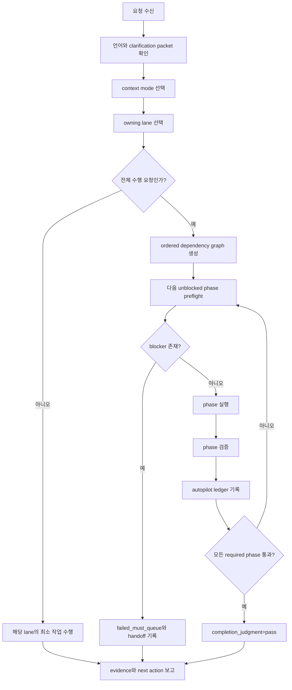

# beta-A GEO 설명서

작성일: 2026-05-13

이 문서는 `beta-A` 브랜치에서 구현 중인 `geo` 패키지의 기능 이름,
효과, 메커니즘, 근거를 한 번에 확인하기 위한 한국어 설명서다.

## 판단 경계

이 문서의 근거는 현재 저장소 파일과 로컬 검증 결과다. 따라서 아래 표의
`근거`는 기능이 문서와 validator 계약에 구현되어 있다는 증거이지, 특정
외부 플랫폼에서 GEO 성과가 실제로 발생했다는 측정 증거는 아니다.

GEO 성과, AI 답변 노출, citation, referral, conversion 같은 결과 주장은
별도 측정 capture가 있어야 한다.

## beta-A의 핵심 방향

`beta-A`는 기존 `geo` 패키지를 단순한 GEO 설명/라우팅 스킬에서
순서의존적 실행 패키지로 확장한다.

핵심은 세 가지다.

1. 사용자가 방법을 몰라도 `전부 해줘`, `전체 진행`, `do everything`처럼
   말하면 GEO가 전체 프로세스를 자동 구성한다.
2. 각 단계는 `계획 -> 실행 -> 검증 -> ledger 기록 -> 다음 단계` 순서로
   진행된다.
3. 측정된 사실, 해석, 가정, 불확실성을 분리해 과장된 GEO claim을 막는다.

## 전체 기능 표

| 기능 이름 | 효과 | 메커니즘 | 근거 |
| --- | --- | --- | --- |
| 대표 GEO 라우터 | GEO 요청을 하나의 진입점에서 받아 적절한 source, lane, subskill로 연결한다. | `geo <request>` / `$geo <request>` 요청을 `portable-baseline`, `user-material`, `local-overlay` 중 하나로 분류하고 lane을 선택한다. | `SKILL.md`의 `Identity`, `Context Modes`, `Request Classification` |
| Source-order 보호 | 원본보다 결과물을 먼저 고치는 문제를 막는다. | 사용자 자료 또는 확인된 local source를 bundled reference보다 우선하고, derived output은 downstream으로만 다룬다. | `SKILL.md`의 `Canonical SoT`, `Source-order rules`; `references/concept-map.md` |
| Clarification-first intake | 모호한 요청을 바로 실행하지 않고 완료 조건을 먼저 잠근다. | `goal / scope / surface / success / evidence target`을 clarification packet으로 고정한다. | `SKILL.md`의 `Clarification-First Intake`; `references/gate-conditions.md` Gate 2 |
| 대화 언어 선택 | 한국어/영어 대화 선택을 source나 prompt 언어와 섞지 않는다. | 첫 GEO 세션에서 Korean/English를 선택하고, 저장 prompt와 routing example은 영어로 유지한다. | `SKILL.md`의 `Prompt and Conversation Language`; `README.md` 사용법 섹션 |
| 고급 실행 bundle 라우팅 | audit, schema, report, proposal 같은 실행 작업을 전용 subskill로 보낸다. | `skills/*` 존재를 확인한 뒤 `references/execution-skill-matrix.md`를 통해 `geo-*` subskill을 선택한다. | `references/execution-skill-matrix.md`; `SKILL.md` Gate 6 |
| Sequence-dependent autopilot | 사용자가 전체 과정을 몰라도 끝까지 진행할 수 있게 한다. | all-in trigger를 감지하면 ordered dependency graph를 만들고, 각 unblocked phase를 실행/검증/기록하며 계속 진행한다. | `references/sequence-dependent-autopilot.md`; `SKILL.md`의 `Sequence-Dependent Autopilot`, Gate 14 |
| Autopilot stop condition | 자동 진행이 위험한 지점을 명확히 멈춘다. | destructive operation, credential, payment, external decision, missing source, high-risk judgment, unclear validation failure에서 중단한다. | `references/sequence-dependent-autopilot.md`의 `Stop Conditions` |
| Autopilot ledger | 전체 수행 과정이 추적 가능해진다. | phase별 `status`, `owner`, `evidence`, `measured_facts`, `interpretation`, `assumptions`, `unknowns`, `next_action`을 기록한다. | `references/sequence-dependent-autopilot.md`의 `Autopilot Ledger` |
| Cogarch alignment | broad request를 실행 가능한 판단 루프로 닫는다. | `Goal -> Rubric -> Iteration -> Score -> Next Action`, owner split, actor-first handoff, portable knowledge packet을 GEO에 맞게 증류한다. | `references/cogarch-alignment.md` |
| Cogarch dependency 차단 | GEO가 hidden cogarch runtime에 의존하지 않게 한다. | `cogarch`, `~/.cogarch`, `OPERATIONS.md`, hidden workspace state를 필수 의존성으로 만들지 못하게 한다. | `references/cogarch-alignment.md`의 `Fail Conditions`; `references/execution-skill-matrix.md` |
| 측정 claim 분리 | readiness와 실제 관측 결과를 혼동하지 않는다. | readiness, heuristic, observed answer, observed citation, referral, conversion을 분리한다. | `references/measurement-loop.md`; `SKILL.md` Gate 8 |
| Commerce/action readiness 분리 | schema validity를 commerce 성과로 과장하지 않는다. | product, schema, merchant, catalog, checkout/action, measurement readiness를 별도 상태로 다룬다. | `references/commerce-readiness.md`; `references/commerce-audit-worksheet.md`; `SKILL.md` Gate 9 |
| Private surface routing | private evidence를 public visibility claim으로 승격하지 않는다. | public crawler/search, private connector, logged-in user, user-provided context를 분리한다. | `references/private-surface-routing.md`; `SKILL.md` Gate 10 |
| Regional/situational routing | 지역/언어/vertical claim의 근거 없는 일반화를 막는다. | region, language market, local platform, vertical, brand maturity를 별도 조건으로 분류한다. | `references/regional-situational-routing.md`; `SKILL.md` Gate 11 |
| Policy risk gate | 정책/법적 위험을 safe로 과장하지 않는다. | robots, terms, privacy, regulated claims, brand claims, commerce eligibility를 확인한다. | `references/policy-risk-gate.md`; `SKILL.md` Gate 12 |
| Report template contract | 보고서가 claim type과 evidence quality를 드러내게 한다. | `score_type`, `evidence_label`, `confidence`, `measurement_status`, `commerce_status`, `private_surface_status`, `regional_context`, `policy_risk`를 요구한다. | `references/report-template-contract.md` |
| Claim boundary ledger | 사실, 해석, 가정, 불확실성이 섞이지 않게 한다. | 보고서에 measured facts, interpretation, assumptions, unknowns를 분리하는 ledger를 둔다. | `references/report-template-contract.md`; `references/cogarch-alignment.md` |
| Actor-first handoff | 같은 분석을 의사결정자/운영자/빌더가 바로 쓸 수 있게 포장한다. | decision maker, operator, builder별 handoff content를 다르게 구성하되 evidence depth는 줄이지 않는다. | `references/report-template-contract.md`; `references/cogarch-alignment.md`; `references/user-level-workflow-guide.md` |
| Whole-system completion boundary | “완료”를 감으로 선언하지 않는다. | `completion_judgment`, `all_must_passed`, `failed_must_queue`, `verification_set`, `report_artifact_path`를 요구한다. | `references/implementation-completion-plan.md`; `SKILL.md` Gate 13 |
| Validator hardening | 새 계약이 빠지면 검증에서 실패하게 한다. | `scripts/check_geo_skill.py`가 필수 파일, gate, reference phrase, autopilot phrase를 검사한다. | `scripts/check_geo_skill.py`; `python3 scripts/check_geo_skill.py` 통과 |
| Runtime compatibility boundary | runtime별 차이를 core contract와 섞지 않는다. | shared portable core를 유지하고 runtime-specific delta는 명시된 surface에만 둔다. | `references/runtime-adaptation.md`; `agents/openai.yaml` |
| Package portability | 다른 skill root로 이동해도 읽히는 패키지 상태를 유지한다. | hidden local path 금지, setup/dependency/source/license note, `skills-ref validate`와 `quick_validate.py`로 검증한다. | `scripts/check_geo_skill.py`; `generate-skill` validator 실행 결과 |

## 순서의존적 전체 프로세스

`beta-A`의 GEO는 요청을 아래 순서로 처리한다.



### 1. 요청 수신

사용자가 GEO 관련 요청을 한다. 예시는 다음과 같다.

- `geo 이 사이트 전체 감사해줘`
- `전체 진행`
- `전부 해줘`
- `do everything needed for this GEO report`
- `schema부터 보고서까지 끝까지 해줘`

### 2. Clarification packet 고정

아래 항목이 충분히 명확하면 바로 진행한다.

| 필드 | 의미 |
| --- | --- |
| `goal` | 이번 작업의 완료 결과 |
| `scope` | 포함/제외 범위 |
| `surface` | 작업 기준 source 또는 workspace |
| `success` | 성공 판단 기준 |
| `evidence target` | 무엇으로 증명할지 |

명확하지 않고 안전한 기본값도 없으면 최소 질문만 한다.

### 3. Context mode 선택

| mode | 사용 시점 |
| --- | --- |
| `portable-baseline` | 사용자 source나 local overlay가 없고 bundled reference로 답할 수 있을 때 |
| `user-material` | 사용자가 pasted text, 파일, URL, source material을 제공했을 때 |
| `local-overlay` | 확인된 workspace, repo, `skills/*` 실행 bundle이 있을 때 |

### 4. Lane 선택

| lane | 역할 |
| --- | --- |
| `framework-source` | 개념, 강의, 전략 구조 |
| `working-source` | 실제 수정할 문서나 파일 |
| `evidence-note` | 근거, 검증, issue 상태 |
| `asset-surface` | checklist, handout, template |
| `execution-bundle` | audit, crawler, schema, report, proposal 등 실행 |
| `derived-deliverable` | HTML, slides, PDF, export |

여러 lane이 걸리면 source와 evidence를 먼저 확정하고, 실행과 derived output은 뒤에 둔다.

### 5. 전체 수행 trigger 판정

아래 표현이 있으면 `sequence-dependent autopilot`이 켜진다.

| trigger | 의미 |
| --- | --- |
| `전부 해줘` | 사용자가 단계 선택을 위임함 |
| `전체 진행` | 전체 프로세스 수행 요청 |
| `전체 수행` | 모든 required phase 수행 요청 |
| `끝까지 해줘` | 완료 또는 blocker까지 지속 진행 |
| `알아서 다 해줘` | GEO가 dependency graph를 구성해야 함 |
| `처음부터 끝까지` | intake부터 closeout까지 수행 |
| `do everything` | all-in request |
| `run the whole process` | 전체 workflow 실행 |
| `continue until complete` | 중간 계획에서 멈추지 말라는 요청 |

### 6. Ordered dependency graph 구성

GEO는 선택된 lane과 reference를 기준으로 필요한 phase를 구성한다.

예시:

| phase | depends_on | owner | 검증 |
| --- | --- | --- | --- |
| intake-lock | none | `geo` | clarification packet 존재 |
| source-selection | intake-lock | `geo` | source mode 기록 |
| setup-check | source-selection | `geo` | `skills/*` 또는 fallback 확인 |
| audit-execution | setup-check | `geo-audit` | audit artifact 또는 evidence |
| report-synthesis | audit-execution | `geo-report` | report template contract |
| handoff | report-synthesis | `geo` | actor-first handoff |
| closeout | handoff | `geo` | `completion_judgment` |

### 7. Phase 실행

각 phase는 하나씩 진행된다.

- 다음 phase가 unblocked인지 확인한다.
- 필요한 파일, subskill, 권한, tool, network, output surface를 확인한다.
- 안전한 최소 실행 단위를 수행한다.
- subskill이 필요하면 존재를 확인한 뒤 위임한다.

### 8. Phase 검증

검증은 phase의 성격에 따라 달라진다.

| phase 종류 | 검증 예시 |
| --- | --- |
| package contract | `python3 scripts/check_geo_skill.py` |
| markdown/document | source path 존재, 필수 section, link 검토 |
| code/script | validator, unit check, `git diff --check` |
| report | `references/report-template-contract.md` 필드 충족 |
| observed outcome | capture artifact, date, prompt, source URL |
| commerce/action | commerce readiness worksheet |
| policy risk | policy risk gate |

### 9. Ledger 기록

전체 수행 중에는 아래 구조로 기록할 수 있다.

```yaml
autopilot:
  trigger: 전체 진행
  scope: selected GEO task
  source_mode: local-overlay
  phases:
    - id: phase-id
      status: passed
      owner: geo
      evidence:
        - command_or_path
      measured_facts:
        - verified fact
      interpretation:
        - what the fact means
      assumptions:
        - accepted but unverified condition
      unknowns:
        - missing evidence
      next_action: next phase
  completion_judgment: pass
  all_must_passed: true
  failed_must_queue: []
```

### 10. Closeout

완료 보고는 아래 중 하나로 닫힌다.

```text
completion_judgment=pass
all_must_passed=true
verification_set=<commands and artifacts>
```

또는:

```text
completion_judgment=blocked
all_must_passed=false
failed_must_queue=<ordered blockers>
```

## 사용자가 몰라도 되는 것

`beta-A`의 목적은 사용자가 내부 구조를 몰라도 쓸 수 있게 하는 것이다.

사용자는 아래를 몰라도 된다.

- `geo-audit`, `geo-report`, `geo-schema` 같은 subskill 이름
- Gate 8-14의 정확한 명칭
- 어떤 reference가 어떤 claim을 담당하는지
- 어떤 validator를 언제 돌려야 하는지
- report template metadata 이름
- `measured / interpretation / assumption / unknown` ledger 형식

사용자가 `전체 진행`처럼 말하면 GEO가 필요한 내부 절차를 선택해야 한다.

## 구현 근거 묶음

현재 `beta-A`에서 이 설명서가 근거로 삼는 주요 파일은 다음과 같다.

| 파일 | 역할 |
| --- | --- |
| `SKILL.md` | 대표 라우터, context mode, lane, Gate 14, standard response shape |
| `references/sequence-dependent-autopilot.md` | 전체 수행 trigger, ordered process, stop condition, ledger |
| `references/cogarch-alignment.md` | governance pattern, owner split, actor-first handoff, knowledge packet |
| `references/execution-skill-matrix.md` | advanced subskill routing matrix |
| `references/report-template-contract.md` | report metadata, claim boundary ledger, actor-first handoff |
| `references/implementation-completion-plan.md` | RQ/P sequence, completion judgment |
| `references/gate-conditions.md` | Gate 0-14의 entry/exit/fail 조건 |
| `references/experiment-scenarios.md` | routing behavior 실험 시나리오 |
| `scripts/check_geo_skill.py` | package contract validator |

## 현재 검증 상태

최근 `beta-A` 작업에서 확인한 검증 상태:

| 검증 | 상태 | 의미 |
| --- | --- | --- |
| `python3 scripts/check_geo_skill.py` | 통과 | GEO portable contract와 새 autopilot reference 연결이 유효함 |
| `git diff --check` | 통과 | whitespace/error marker 문제 없음 |
| `quick_validate.py <this-checkout>` | 통과, 경고 있음 | skill package로 유효하지만 폴더명 `geo-beta-A`와 skill name `geo`가 달라 경고 발생 |
| `skills-ref validate` 임시 `geo` symlink | 통과 | 공식 skill name 기준으로는 유효함 |
| `audit_three_layer_separation.py` | `smells: 0` | Fixed/Flexible/Decisional 분리에서 advisory smell 없음 |

## beta-A 한 줄 설명

`beta-A`의 GEO는 사용자가 GEO 작업 절차를 몰라도 원본 확인, 실행 workflow
선택, 단계별 수행, 검증, 보고서화, handoff, 완료 판단까지 자동으로 이어가는
portable GEO execution router다.
