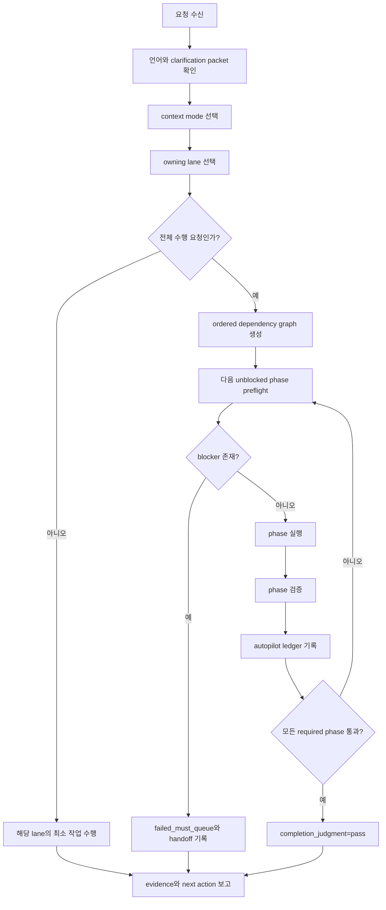

# beta-A GEO 설명서

작성일: 2026-05-13

이 문서는 `beta-A` 브랜치에서 구현 중인 `geo` 패키지의 기능 이름,
효과, 메커니즘, 외부 근거, 그리고 현재 기능이 근거 기반으로 설계/구현돼
있다는 입증 증거를 한 번에 확인하기 위한 한국어 설명서다.

## 판단 경계

이 문서에서 `근거`는 우리가 정리한 내부 문서가 아니라, 우리 외부의
공식 문서, 표준, 학술 문헌, 또는 공학적으로 검증 가능한 원리를 뜻한다.

현재 저장소 파일과 로컬 검증 결과는 외부 타당성 근거 자체가 아니다.
대신 `근거 기반 설계/구현 입증 증거`로 사용한다. 즉, `SKILL.md`,
`references/*`, `scripts/check_geo_skill.py`는 외부 근거와 공학 원리가
beta-A 기능 구조에 실제로 반영돼 있는지를 입증하는 구현 surface와 검증
surface다.

GEO 성과, AI 답변 노출, citation, referral, conversion 같은 결과 주장은
별도 측정 capture가 있어야 한다.

## beta-A 대표 스킬명 경계

`beta-A`는 별도 스킬명이 아니다. 이 변형은 별도 브랜치, worktree, 폴더로
분리되어 있으므로 대표 스킬명과 실행 진입점은 계속 `geo`다.

따라서 `SKILL.md`의 `name: geo`, `geo <request>`, `$geo <request>`는
beta-A에서도 올바른 대표 surface다. `beta-A`는 배포/검증 단위의 이름이고,
사용자가 호출하는 runtime skill name은 아니다.

## 외부 근거와 타당 원리

아래 표는 beta-A 기능을 정당화하는 외부 근거와 공학 원리를 정리한다.
외부 근거는 기능의 필요성과 판단 경계를 뒷받침하지만, 특정 사이트에서
성과가 이미 발생했다는 측정 증거는 아니다.

| 외부 근거 / 원리 | beta-A에서 정당화하는 판단 | 한계 |
| --- | --- | --- |
| [ISO/IEC/IEEE 42010:2022](https://www.iso.org/standard/74393.html) | software/system architecture description은 구조, 관계, viewpoint를 명시해야 한다. 대표 router, context mode, lane, report/handoff surface를 분리하는 판단을 정당화한다. | architecture description은 구조 타당성을 뒷받침하지만 GEO 성과를 보장하지 않는다. |
| [W3C PROV Overview](https://www.w3.org/TR/prov-overview/) | provenance는 entity, activity, people, processing step, derivation을 통해 품질, 신뢰성, trustworthiness 판단에 쓰일 수 있다. source-order, ledger, claim boundary를 정당화한다. | provenance가 있다고 해서 source 내용이 사실이거나 outcome이 발생했다는 뜻은 아니다. |
| [NIST TREC](https://trec.nist.gov/about.html) | retrieval 평가는 topic, collection, relevance judgment, evaluation artifact가 필요하다. AI answer/citation/referral/conversion을 readiness와 분리하는 판단을 정당화한다. | TREC 원리는 평가 구조의 근거이지 개별 platform ranking을 직접 설명하지 않는다. |
| [NIST AI RMF 1.0](https://www.nist.gov/publications/artificial-intelligence-risk-management-framework-ai-rmf-10) | AI/automation 시스템은 design, development, deployment/use, evaluation 전반에서 risk와 trustworthiness를 관리해야 한다. stop condition, policy gate, human boundary를 정당화한다. | risk framework는 통제 구조의 근거이지 자동화 결과의 성공 보장이 아니다. |
| [RFC 9309 Robots Exclusion Protocol](https://www.rfc-editor.org/rfc/rfc9309.html), [OpenAI crawler 문서](https://developers.openai.com/api/docs/bots), [Google crawler 문서](https://developers.google.com/crawling/docs/crawlers-fetchers/overview-google-crawlers), [Perplexity crawler 문서](https://docs.perplexity.ai/docs/resources/perplexity-crawlers) | crawler 접근성, robots 정책, platform별 bot 차이를 분리해야 한다. `geo-crawlers`, `platform-truth-registry`, `policy-risk-gate`가 이 판단을 담당한다. | crawler 허용은 발견 가능성의 조건일 수 있지만 AI 답변 노출, citation, 순위, conversion을 보장하지 않는다. |
| [W3C JSON-LD 1.1 Recommendation](https://www.w3.org/TR/json-ld11/), [Schema.org schema hierarchy](https://schema.org/docs/schemas.html), [Google Merchant Listing structured data](https://developers.google.com/search/docs/appearance/structured-data/merchant-listing) | 구조화 데이터는 기계 판독 가능한 의미 표현과 eligibility 검토의 기반이다. `geo-schema`, `commerce-readiness`, `commerce-audit-worksheet`가 이 판단을 담당한다. | schema 유효성이나 merchant listing eligibility는 실제 노출, 판매, action 수행을 뜻하지 않는다. |
| [IndexNow documentation](https://www.indexnow.org/documentation) | URL 변경 통지는 indexing workflow의 한 입력 신호로 다룰 수 있다. 기술 최적화와 platform readiness에서 submission 상태를 별도로 기록해야 한다. | HTTP 200 수신은 URL을 받았다는 의미이지 색인, 랭킹, AI 답변 노출을 의미하지 않는다. |
| Kitchenham, Dyba, Jorgensen의 Evidence-Based Software Engineering 논문([DOI](https://doi.org/10.1109/ICSE.2004.1317449)) | 실무 claim은 관측, 검증, 한계가 분리되어야 한다. `measurement-loop`, `measurement-capture-template`, `claim boundary ledger`가 이 원리를 적용한다. | 외부 원리만으로는 개별 GEO 성과를 말할 수 없고, 날짜/프롬프트/URL/로그 같은 관측 artifact가 필요하다. |
| Shadish, Cook, Campbell의 experimental/quasi-experimental design 방법론([Cengage](https://www.cengage.com/c/experimental-and-quasi-experimental-designs-for-generalized-causal-inference-2e-shadish-cook-campbell/9780395615560)) | readiness, correlation, observed outcome, causal effect를 구분해야 한다. beta-A는 measured facts, interpretation, assumptions, unknowns를 분리한다. | before/after 변화나 단일 관측은 원인 효과를 자동으로 증명하지 않는다. |
| Parnas의 modular decomposition 원리([DOI](https://doi.org/10.1145/361598.361623)) | 실행 책임을 대표 router와 subskill로 분리해야 변경과 검증이 쉬워진다. `execution-skill-matrix`와 `skills/geo-*` routing이 이 공학 원리를 따른다. | 모듈화 원리는 실행 구조의 타당성 근거이지 GEO 시장 성과의 근거가 아니다. |

## beta-A의 핵심 방향

`beta-A`는 기존 `geo` 패키지를 단순한 GEO 설명/라우팅 스킬에서
순서의존적 실행 패키지로 확장한다.

핵심은 세 가지다.

1. 사용자가 방법을 몰라도 `전부 해줘`, `전체 진행`, `do everything`처럼
   말하면 GEO가 전체 프로세스를 자동 구성한다.
2. 각 단계는 `계획 -> 실행 -> 검증 -> ledger 기록 -> 다음 단계` 순서로
   진행된다.
3. 측정된 사실, 해석, 가정, 불확실성을 분리해 과장된 GEO claim을 막는다.

## 전체 기능 및 근거 기반 구현 매칭 표

아래 표의 마지막 열은 단순 파일 목록이 아니다. 각 행은 `외부 타당성 근거
또는 공학 원리 -> beta-A 구현 surface -> 검증 surface`를 묶어, 현재
기능이 근거 기반으로 만들어져 있다는 점을 입증한다.

| 기능 이름 | 효과 | 메커니즘 | 근거 기반 설계/구현 입증 증거 |
| --- | --- | --- | --- |
| 대표 GEO 라우터 | GEO 요청을 하나의 진입점에서 받아 적절한 source, lane, subskill로 연결한다. | `geo <request>` / `$geo <request>` 요청을 `portable-baseline`, `user-material`, `local-overlay` 중 하나로 분류하고 lane을 선택한다. | ISO/IEC/IEEE 42010의 architecture description, Parnas의 modular decomposition, W3C PROV의 provenance, NIST AI RMF의 risk-control 원리에 맞춰 boundary/source/lane을 분리했다. 구현: `SKILL.md` `Identity`, `Context Modes`, `Request Classification`; 검증: `scripts/check_geo_skill.py` 필수 섹션 검사. |
| Source-order 보호 | 원본보다 결과물을 먼저 고치는 문제를 막는다. | 사용자 자료 또는 확인된 local source를 bundled reference보다 우선하고, derived output은 downstream으로만 다룬다. | W3C PROV의 provenance/derivation 원리와 EBSE의 evidence separation에 따라 source precedence를 보존한다. 구현: `SKILL.md` `Canonical SoT`, `Source-order rules`, `references/concept-map.md`; 검증: `references/gate-conditions.md` source/mode gate. |
| Clarification-first intake | 모호한 요청을 바로 실행하지 않고 완료 조건을 먼저 잠근다. | `goal / scope / surface / success / evidence target`을 clarification packet으로 고정한다. | NIST AI RMF의 context/risk 관리와 EBSE의 evidence-based decision 원리에 따라 실행 전에 판단 기준을 고정한다. 구현: `SKILL.md` `Clarification-First Intake`, `references/gate-conditions.md` Gate 2; 검증: validator 필수 phrase/gate 검사. |
| 대화 언어 선택 | 한국어/영어 대화 선택을 source나 prompt 언어와 섞지 않는다. | 첫 GEO 세션에서 Korean/English를 선택하고, 저장 prompt와 routing example은 영어로 유지한다. | W3C PROV 관점에서 source language, prompt language, conversation language를 섞지 않아 evidence context를 보존한다. 구현: `SKILL.md` `Prompt and Conversation Language`, `README.md` 사용법; 검증: `scripts/check_geo_skill.py` 필수 섹션 검사. |
| 고급 실행 bundle 라우팅 | audit, schema, report, proposal 같은 실행 작업을 전용 subskill로 보낸다. | `skills/*` 존재를 확인한 뒤 `references/execution-skill-matrix.md`를 통해 `geo-*` subskill을 선택한다. | Parnas의 modular decomposition 원리에 따라 대표 router와 실행 subskill 책임을 분리한다. 구현: `references/execution-skill-matrix.md`, `SKILL.md` Gate 6; 검증: validator reference/phrase 검사. |
| Sequence-dependent autopilot | 사용자가 전체 과정을 몰라도 끝까지 진행할 수 있게 한다. | all-in trigger를 감지하면 ordered dependency graph를 만들고, 각 unblocked phase를 실행/검증/기록하며 계속 진행한다. | NIST AI RMF의 lifecycle risk 관리와 EBSE의 단계적 evidence closure 원리에 따라 broad request를 ordered process로 변환한다. 구현: `references/sequence-dependent-autopilot.md`, `SKILL.md` `Sequence-Dependent Autopilot`, Gate 14; 검증: validator autopilot phrase 검사. |
| Autopilot stop condition | 자동 진행이 위험한 지점을 명확히 멈춘다. | destructive operation, credential, payment, external decision, missing source, high-risk judgment, unclear validation failure에서 중단한다. | NIST AI RMF의 human/organizational risk boundary 원리에 따라 자동화가 승인, 결제, 자격 증명, 법적 판단을 넘지 않게 한다. 구현: `references/sequence-dependent-autopilot.md` `Stop Conditions`; 검증: Gate 14 및 validator phrase 검사. |
| Autopilot ledger | 전체 수행 과정이 추적 가능해진다. | phase별 `status`, `owner`, `evidence`, `measured_facts`, `interpretation`, `assumptions`, `unknowns`, `next_action`을 기록한다. | W3C PROV의 entity/activity/person/derivation 표현과 EBSE의 evidence tracking 원리에 맞춰 phase provenance를 남긴다. 구현: `references/sequence-dependent-autopilot.md` `Autopilot Ledger`; 검증: report/ledger contract와 validator reference 검사. |
| Cogarch alignment | broad request를 실행 가능한 판단 루프로 닫는다. | `Goal -> Rubric -> Iteration -> Score -> Next Action`, owner split, actor-first handoff, portable knowledge packet을 GEO에 맞게 증류한다. | EBSE의 evidence-based decision cycle과 ISO/IEC/IEEE 42010의 stakeholder/viewpoint 분리 원리를 GEO 실행 판단에 적용한다. 구현: `references/cogarch-alignment.md`; 검증: validator reference phrase 검사. |
| Cogarch dependency 차단 | GEO가 hidden cogarch runtime에 의존하지 않게 한다. | `cogarch`, `~/.cogarch`, `OPERATIONS.md`, hidden workspace state를 필수 의존성으로 만들지 못하게 한다. | Parnas의 module boundary와 portability 원리에 따라 hidden runtime state를 portable package contract에서 제외한다. 구현: `references/cogarch-alignment.md` `Fail Conditions`, `references/execution-skill-matrix.md`; 검증: package portability validator. |
| 측정 claim 분리 | readiness와 실제 관측 결과를 혼동하지 않는다. | readiness, heuristic, observed answer, observed citation, referral, conversion을 분리한다. | NIST TREC의 retrieval evaluation 구조와 Shadish/Cook/Campbell의 causal inference 경계에 따라 readiness, observation, causality를 분리한다. 구현: `references/measurement-loop.md`, `SKILL.md` Gate 8; 검증: report template evidence labels. |
| Commerce/action readiness 분리 | schema validity를 commerce 성과로 과장하지 않는다. | product, schema, merchant, catalog, checkout/action, measurement readiness를 별도 상태로 다룬다. | JSON-LD/Schema.org/Google merchant structured data 문서의 eligibility 경계에 따라 schema validity와 commerce outcome을 분리한다. 구현: `references/commerce-readiness.md`, `references/commerce-audit-worksheet.md`, `SKILL.md` Gate 9; 검증: commerce audit worksheet/report metadata. |
| Private surface routing | private evidence를 public visibility claim으로 승격하지 않는다. | public crawler/search, private connector, logged-in user, user-provided context를 분리한다. | W3C PROV의 evidence context 원리와 NIST AI RMF의 privacy/risk boundary에 따라 private surface와 public visibility를 구분한다. 구현: `references/private-surface-routing.md`, `SKILL.md` Gate 10; 검증: report template private surface status. |
| Regional/situational routing | 지역/언어/vertical claim의 근거 없는 일반화를 막는다. | region, language market, local platform, vertical, brand maturity를 별도 조건으로 분류한다. | Shadish/Cook/Campbell의 external validity 경계와 EBSE의 context-sensitive evidence 원리에 따라 일반화 조건을 명시한다. 구현: `references/regional-situational-routing.md`, `SKILL.md` Gate 11; 검증: report template regional context. |
| Policy risk gate | 정책/법적 위험을 safe로 과장하지 않는다. | robots, terms, privacy, regulated claims, brand claims, commerce eligibility를 확인한다. | RFC 9309와 platform crawler 문서, NIST AI RMF risk-control 원리에 따라 technical access, policy, legal/regulated claim을 분리한다. 구현: `references/policy-risk-gate.md`, `SKILL.md` Gate 12; 검증: policy risk metadata. |
| Report template contract | 보고서가 claim type과 evidence quality를 드러내게 한다. | `score_type`, `evidence_label`, `confidence`, `measurement_status`, `commerce_status`, `private_surface_status`, `regional_context`, `policy_risk`를 요구한다. | W3C PROV와 EBSE 원리에 따라 report가 claim, evidence, confidence, limitation을 분리하도록 만든다. 구현: `references/report-template-contract.md`; 검증: report metadata contract. |
| Claim boundary ledger | 사실, 해석, 가정, 불확실성이 섞이지 않게 한다. | 보고서에 measured facts, interpretation, assumptions, unknowns를 분리하는 ledger를 둔다. | EBSE와 experimental/quasi-experimental design 원리에 따라 observed fact, interpretation, assumption, unknown을 분리한다. 구현: `references/report-template-contract.md`, `references/cogarch-alignment.md`; 검증: claim boundary ledger requirement. |
| Actor-first handoff | 같은 분석을 의사결정자/운영자/빌더가 바로 쓸 수 있게 포장한다. | decision maker, operator, builder별 handoff content를 다르게 구성하되 evidence depth는 줄이지 않는다. | ISO/IEC/IEEE 42010의 stakeholder/viewpoint 원리에 따라 같은 evidence를 수신자별 decision surface로 변환한다. 구현: `references/report-template-contract.md`, `references/cogarch-alignment.md`, `references/user-level-workflow-guide.md`; 검증: actor-first handoff requirement. |
| Whole-system completion boundary | “완료”를 감으로 선언하지 않는다. | `completion_judgment`, `all_must_passed`, `failed_must_queue`, `verification_set`, `report_artifact_path`를 요구한다. | EBSE의 verification/limitation 원리와 NIST AI RMF의 evaluation boundary에 따라 완료를 evidence set으로 판단한다. 구현: `references/implementation-completion-plan.md`, `SKILL.md` Gate 13; 검증: validator completion/gate checks. |
| Validator hardening | 새 계약이 빠지면 검증에서 실패하게 한다. | `scripts/check_geo_skill.py`가 필수 파일, gate, reference phrase, autopilot phrase를 검사한다. | architecture contract와 reproducibility 원리에 따라 기능 설명이 패키지 surface에서 실제로 확인 가능해야 한다. 구현/검증: `scripts/check_geo_skill.py`; 현재 검증: `python3 scripts/check_geo_skill.py` 통과. |
| Runtime compatibility boundary | runtime별 차이를 core contract와 섞지 않는다. | shared portable core를 유지하고 runtime-specific delta는 명시된 surface에만 둔다. | ISO/IEC/IEEE 42010의 architecture description boundary와 Parnas의 change-hiding 원리에 따라 core와 runtime delta를 분리한다. 구현: `references/runtime-adaptation.md`, `agents/openai.yaml`; 검증: package validator. |
| Package portability | 다른 skill root로 이동해도 읽히는 패키지 상태를 유지한다. | hidden local path 금지, setup/dependency/source/license note, `skills-ref validate`와 `quick_validate.py`로 검증한다. | modularity, provenance, reproducibility 원리에 따라 hidden local state 없이 package contract가 재검증 가능해야 한다. 구현: `scripts/check_geo_skill.py`, package metadata; 검증: `quick_validate.py`, `skills-ref validate`, `python3 scripts/check_geo_skill.py`. |

## Execution Skill Matrix

이 섹션은 `beta-A`의 `references/execution-skill-matrix.md` 내용을
소개 문서 안에서 바로 볼 수 있도록 옮긴 것이다. 이 표는 "어떤 기능이
어떤 subskill로 실행되는가"를 정리한다.

### Advanced workflow 활성 조건

`SKILL.md`는 대표 `geo` router로 남고, 실제 실행 의도가 있는 요청은
`skills/*` 존재가 확인된 뒤에만 matching subskill로 라우팅된다.

고급 workflow를 사용하려면 다음 조건이 필요하다.

- `skills/*` bundle이 같은 GEO checkout 또는 설치본 안에 있어야 한다.
- 이 `beta-A` worktree에는 `skills/` bundle이 포함되어 있다.
- 사용자는 `geo <request>` 또는 `$geo <request>`로 시작할 수 있다.
- 요청이 audit, crawler, `llms.txt`, schema, compare, report, proposal,
  prospect, technical review 중 하나로 분류되면 matching subskill을 연다.
- workflow가 추가 도구, 네트워크 접근, export 단계를 필요로 하면 해당
  `skills/geo-*/SKILL.md`가 setup, permission, output contract를 소유한다.

### User-level output guide

같은 분석 결과라도 수신자에 따라 포장 방식이 달라진다. 단, 설명 방식만
달라질 뿐 evidence depth를 줄이거나 readiness를 measured visibility로
승격해서는 안 된다.

| Profile | Output shape |
| --- | --- |
| `L1` manager | 비즈니스 언어, 우선순위, 의사결정, 다른 팀 handoff |
| `L2` operator | CMS, hosting, 파일, 운영 절차, 검증 단계 |
| `L3` builder | code, schema, CLI check, automation, export command |

### Standalone execution subskills

| Skill | Primary use | Typical trigger | Local profile | Typical output |
| --- | --- | --- | --- | --- |
| `geo-audit` | full GEO + SEO audit across crawler, citability, content, technical, and platform signals | `전체 감사`, `사이트 분석`, `audit` | `L1/L2/L3` | `GEO-감사-보고서.md` |
| `geo-brand-mentions` | external brand mention visibility across media, communities, and AI-visible sources | `브랜드 언급`, `brand mentions` | `L1/L2/L3` | mention visibility assessment |
| `geo-citability` | AI citation likelihood for answer-ready, authoritative pages | `인용 가능성`, `citability` | `L1/L2/L3` | citation score and gaps |
| `geo-compare` | side-by-side GEO gap analysis versus competitors | `경쟁사 비교`, `compare` | `L2/L3` | comparative gap analysis |
| `geo-content` | content quality and E-E-A-T review | `콘텐츠 품질`, `E-E-A-T`, `content` | `L1/L2/L3` | content trust findings |
| `geo-crawlers` | robots, bot access, `llms.txt`, and crawlability review | `크롤러`, `robots.txt`, `crawlers` | `L1/L2/L3` | crawler access findings |
| `geo-llmstxt` | `llms.txt` audit and generation template | `llms.txt`, `llmstxt` | `L2/L3` | `llms.txt` recommendation or template |
| `geo-platform-optimizer` | platform-specific readiness and observed-capture planning for Google AI Overviews, Perplexity, ChatGPT, Copilot, and Grok | `플랫폼 최적화`, `platform` | `L1/L2/L3` | platform scorecard |
| `geo-proposal` | client or internal improvement proposal from GEO findings | `제안서`, `proposal` | `L3` | sprint roadmap proposal |
| `geo-prospect` | lightweight prospect scan for sales or consulting discovery | `잠재 고객`, `prospect` | `L3` | prospect scan summary |
| `geo-report` | consolidated GEO report synthesis from individual findings | `보고서`, `report`, `요약` | `L1/L2/L3` | consolidated roadmap report |
| `geo-report-pdf` | print-ready markdown packaging for PDF delivery | `PDF 보고서`, `report-pdf` | `L3` | PDF-oriented report markdown |
| `geo-schema` | JSON-LD schema generation and validation | `스키마`, `JSON-LD`, `schema` | `L3` | `GEO-스키마-[도메인].md` |
| `geo-technical` | technical SEO diagnosis and remediation guidance | `기술 SEO`, `Core Web Vitals`, `technical` | `L2/L3` | technical remediation notes |

### Routing rules

1. 정확한 subskill owner를 이미 알고 있는 경우가 아니면 대표 `geo`
   entrypoint에서 시작한다.
2. 먼저 `portable-baseline`, `user-material`, `local-overlay` 중 source
   mode를 선택한다.
3. 요청이 execution intent이고 `skills/*`가 있으면 위 표의 matching
   subskill로 라우팅한다.
4. execution bundle이 없으면 portable baseline만으로 audit/report/schema
   workflow를 약속하지 않는다.
5. 생성된 report와 export는 해당 산출을 만들거나 정당화한 execution
   subskill의 downstream output으로 둔다.

### Reference-guided extensions

아래 reference들은 새 standalone subskill을 추가하지 않는다. 대신 기존
subskill이 outcome, commerce/action, policy, completion claim을 어떻게
보고해야 하는지 제한한다.

| Reference | Use with | Purpose |
| --- | --- | --- |
| `references/measurement-loop.md` | `geo-audit`, `geo-brand-mentions`, `geo-citability`, `geo-compare`, `geo-platform-optimizer`, `geo-report`, `geo-proposal` | readiness, heuristic, observed answer, observed citation, referral, conversion evidence 분리 |
| `references/commerce-readiness.md` | `geo-schema`, `geo-platform-optimizer`, `geo-report`, `geo-proposal`, `geo-technical` | product/schema readiness와 merchant, catalog, checkout, action, measurement readiness 분리 |
| `references/platform-truth-registry.md` | `geo-crawlers`, `geo-platform-optimizer`, `geo-compare`, `geo-prospect`, `geo-report` | platform crawler와 commerce mechanism claim에 source_url, last_verified, confidence, package_action 부여 |
| `references/measurement-capture-template.md` | `geo-audit`, `geo-brand-mentions`, `geo-citability`, `geo-platform-optimizer`, `geo-report`, `geo-proposal` | observed_answer, observed_citation, referral_signal, conversion_signal capture를 반복 가능하게 만듦 |
| `references/commerce-audit-worksheet.md` | `geo-schema`, `geo-platform-optimizer`, `geo-technical`, `geo-report`, `geo-proposal` | product, schema, merchant, catalog/feed, checkout/action, measurement readiness 감사 |
| `references/private-surface-routing.md` | `geo-audit`, `geo-brand-mentions`, `geo-platform-optimizer`, `geo-report`, `geo-proposal` | public crawler/search와 private connector, logged-in user, user-provided context evidence 분리 |
| `references/regional-situational-routing.md` | `geo-audit`, `geo-compare`, `geo-platform-optimizer`, `geo-prospect`, `geo-report`, `geo-proposal` | region, language, vertical, brand maturity, source-pack availability 기준으로 권고 조정 |
| `references/policy-risk-gate.md` | `geo-crawlers`, `geo-content`, `geo-platform-optimizer`, `geo-report`, `geo-proposal`, `geo-technical` | robots, terms, privacy, regulated claim, brand claim, commerce eligibility 점검 |
| `references/report-template-contract.md` | `geo-report`, `geo-report-pdf`, `geo-proposal`, `geo-audit` | score_type, evidence_label, confidence, measurement_status, commerce_status, private_surface_status, regional_context, policy_risk 요구 |
| `references/implementation-completion-plan.md` | `geo`, `geo-report`, `geo-proposal` | all_must_passed 또는 failed_must_queue evidence로 P2-P13 hardening과 whole-system completion 종료 |
| `references/cogarch-alignment.md` | `geo`, `geo-audit`, `geo-report`, `geo-proposal`, `geo-platform-optimizer`, `geo-technical` | `cogarch` 의존 없이 evidence closure, owner split, actor-first handoff, portable knowledge packet 적용 |
| `references/sequence-dependent-autopilot.md` | `geo`, `geo-audit`, `geo-report`, `geo-proposal`, `geo-report-pdf`, `geo-schema`, `geo-technical` | all-in 요청을 ordered dependency graph, phase execution, verification, ledger, completion judgment로 실행 |

### Troubleshooting

- advanced workflow가 보이지 않으면 같은 checkout 또는 설치본에 `skills/*`
  가 있는지 확인한다.
- `README.md`와 `SKILL.md`만 복사했다면 `skills/*`가 포함된 GEO package로
  다시 설치해야 한다.
- 어떤 workflow를 써야 할지 모르면 `geo <request>` 또는 `$geo <request>`
  로 시작하고 router가 matching subskill을 고르게 한다.
- GEO가 clarification question을 먼저 물으면, 실행 subskill을 기대하기 전에
  그 질문에 답해야 한다.
- runtime 또는 model이 바뀌면 setup guide를 다시 실행한다.
- subskill이 tool, network, credential, export step을 요구하면 해당
  subskill의 `SKILL.md`를 따른다.
- 이 workflow는 hidden global file이나 이전 session state command에
  의존하면 안 된다.

## 순서의존적 전체 프로세스

`beta-A`의 GEO는 요청을 아래 순서로 처리한다.



### 1. 요청 수신

사용자가 GEO 관련 요청을 한다. 예시는 다음과 같다.

- `geo 이 사이트 전체 감사해줘`
- `전체 진행`
- `전부 해줘`
- `do everything needed for this GEO report`
- `schema부터 보고서까지 끝까지 해줘`

### 2. Clarification packet 고정

아래 항목이 충분히 명확하면 바로 진행한다.

| 필드 | 의미 |
| --- | --- |
| `goal` | 이번 작업의 완료 결과 |
| `scope` | 포함/제외 범위 |
| `surface` | 작업 기준 source 또는 workspace |
| `success` | 성공 판단 기준 |
| `evidence target` | 무엇으로 증명할지 |

명확하지 않고 안전한 기본값도 없으면 최소 질문만 한다.

### 3. Context mode 선택

| mode | 사용 시점 |
| --- | --- |
| `portable-baseline` | 사용자 source나 local overlay가 없고 bundled reference로 답할 수 있을 때 |
| `user-material` | 사용자가 pasted text, 파일, URL, source material을 제공했을 때 |
| `local-overlay` | 확인된 workspace, repo, `skills/*` 실행 bundle이 있을 때 |

### 4. Lane 선택

| lane | 역할 |
| --- | --- |
| `framework-source` | 개념, 강의, 전략 구조 |
| `working-source` | 실제 수정할 문서나 파일 |
| `evidence-note` | 외부 근거, 구현 검증, issue 상태 |
| `asset-surface` | checklist, handout, template |
| `execution-bundle` | audit, crawler, schema, report, proposal 등 실행 |
| `derived-deliverable` | HTML, slides, PDF, export |

여러 lane이 걸리면 source와 evidence를 먼저 확정하고, 실행과 derived output은 뒤에 둔다.

### 5. 전체 수행 trigger 판정

아래 표현이 있으면 `sequence-dependent autopilot`이 켜진다.

| trigger | 의미 |
| --- | --- |
| `전부 해줘` | 사용자가 단계 선택을 위임함 |
| `전체 진행` | 전체 프로세스 수행 요청 |
| `전체 수행` | 모든 required phase 수행 요청 |
| `끝까지 해줘` | 완료 또는 blocker까지 지속 진행 |
| `알아서 다 해줘` | GEO가 dependency graph를 구성해야 함 |
| `처음부터 끝까지` | intake부터 closeout까지 수행 |
| `do everything` | all-in request |
| `run the whole process` | 전체 workflow 실행 |
| `continue until complete` | 중간 계획에서 멈추지 말라는 요청 |

### 6. Ordered dependency graph 구성

GEO는 선택된 lane과 reference를 기준으로 필요한 phase를 구성한다.

예시:

| phase | depends_on | owner | 검증 |
| --- | --- | --- | --- |
| intake-lock | none | `geo` | clarification packet 존재 |
| source-selection | intake-lock | `geo` | source mode 기록 |
| setup-check | source-selection | `geo` | `skills/*` 또는 fallback 확인 |
| audit-execution | setup-check | `geo-audit` | audit artifact 또는 evidence |
| report-synthesis | audit-execution | `geo-report` | report template contract |
| handoff | report-synthesis | `geo` | actor-first handoff |
| closeout | handoff | `geo` | `completion_judgment` |

### 7. Phase 실행

각 phase는 하나씩 진행된다.

- 다음 phase가 unblocked인지 확인한다.
- 필요한 파일, subskill, 권한, tool, network, output surface를 확인한다.
- 안전한 최소 실행 단위를 수행한다.
- subskill이 필요하면 존재를 확인한 뒤 위임한다.

### 8. Phase 검증

검증은 phase의 성격에 따라 달라진다.

| phase 종류 | 검증 예시 |
| --- | --- |
| package contract | `python3 scripts/check_geo_skill.py` |
| markdown/document | source path 존재, 필수 section, link 검토 |
| code/script | validator, unit check, `git diff --check` |
| report | `references/report-template-contract.md` 필드 충족 |
| observed outcome | capture artifact, date, prompt, source URL |
| commerce/action | commerce readiness worksheet |
| policy risk | policy risk gate |

### 9. Ledger 기록

전체 수행 중에는 아래 구조로 기록할 수 있다.

```yaml
autopilot:
  trigger: 전체 진행
  scope: selected GEO task
  source_mode: local-overlay
  phases:
    - id: phase-id
      status: passed
      owner: geo
      evidence:
        - command_or_path
      measured_facts:
        - verified fact
      interpretation:
        - what the fact means
      assumptions:
        - accepted but unverified condition
      unknowns:
        - missing evidence
      next_action: next phase
  completion_judgment: pass
  all_must_passed: true
  failed_must_queue: []
```

### 10. Closeout

완료 보고는 아래 중 하나로 닫힌다.

```text
completion_judgment=pass
all_must_passed=true
verification_set=<commands and artifacts>
```

또는:

```text
completion_judgment=blocked
all_must_passed=false
failed_must_queue=<ordered blockers>
```

## 사용자가 몰라도 되는 것

`beta-A`의 목적은 사용자가 내부 구조를 몰라도 쓸 수 있게 하는 것이다.

사용자는 아래를 몰라도 된다.

- `geo-audit`, `geo-report`, `geo-schema` 같은 subskill 이름
- Gate 8-14의 정확한 명칭
- 어떤 reference가 어떤 claim을 담당하는지
- 어떤 validator를 언제 돌려야 하는지
- report template metadata 이름
- `measured / interpretation / assumption / unknown` ledger 형식

사용자가 `전체 진행`처럼 말하면 GEO가 필요한 내부 절차를 선택해야 한다.

## 근거 기반 설계/구현 입증 증거 묶음

현재 `beta-A`에서 이 설명서가 "기능이 근거 기반으로 만들어져 있다"는
점을 입증할 때 사용하는 주요 구현/검증 surface는 다음과 같다. 이 파일들은
외부 근거 자체가 아니라, 외부 근거와 공학 원리가 beta-A 기능 구조에
반영돼 있음을 확인하는 증거다.

| 파일 | 근거 기반 구현을 입증하는 역할 |
| --- | --- |
| `SKILL.md` | architecture/provenance/risk-control 원리가 대표 라우터, context mode, lane, Gate 14, standard response shape로 구현돼 있음을 보여준다. |
| `references/sequence-dependent-autopilot.md` | NIST AI RMF와 EBSE식 bounded automation이 전체 수행 trigger, ordered process, stop condition, ledger로 구현돼 있음을 보여준다. |
| `references/cogarch-alignment.md` | evidence closure, owner split, actor-first handoff, portable knowledge packet이 broad request 처리 원리로 구현돼 있음을 보여준다. |
| `references/execution-skill-matrix.md` | Parnas식 modular decomposition이 대표 router와 advanced subskill routing matrix로 구현돼 있음을 보여준다. |
| `references/report-template-contract.md` | W3C PROV/EBSE의 claim/evidence/confidence/limitation 분리가 report metadata와 claim boundary ledger로 구현돼 있음을 보여준다. |
| `references/implementation-completion-plan.md` | 완료 판단이 감이 아니라 requirement, verification, failed queue, completion judgment로 구현돼 있음을 보여준다. |
| `references/gate-conditions.md` | Gate 0-14의 entry/exit/fail 조건으로 risk-control과 source/evidence boundary가 구현돼 있음을 보여준다. |
| `references/experiment-scenarios.md` | routing behavior가 시나리오 단위로 검증 가능하게 설계돼 있음을 보여준다. |
| `scripts/check_geo_skill.py` | 위 계약이 실제 패키지에 존재하는지 자동 검증하는 package contract validator다. |

## 현재 검증 상태

최근 `beta-A` 작업에서 확인한 검증 상태:

| 검증 | 상태 | 의미 |
| --- | --- | --- |
| `python3 scripts/check_geo_skill.py` | 통과 | GEO portable contract와 새 autopilot reference 연결이 유효함 |
| `git diff --check` | 통과 | whitespace/error marker 문제 없음 |
| `quick_validate.py <this-checkout>` | 통과, 경고 있음 | skill package로 유효하다. 폴더명 `geo-beta-A`와 skill name `geo`의 차이는 beta-A를 별도 브랜치/worktree/폴더로 분리했기 때문에 발생하는 의도된 경계이며, skill rename 요구가 아니다. |
| `skills-ref validate` 임시 `geo` symlink | 통과 | 공식 skill name 기준으로는 유효함 |
| `audit_three_layer_separation.py` | `smells: 0` | Fixed/Flexible/Decisional 분리에서 advisory smell 없음 |

## beta-A 한 줄 설명

`beta-A`의 GEO는 사용자가 GEO 작업 절차를 몰라도 원본 확인, 실행 workflow
선택, 단계별 수행, 검증, 보고서화, handoff, 완료 판단까지 자동으로 이어가는
portable GEO execution router다.
